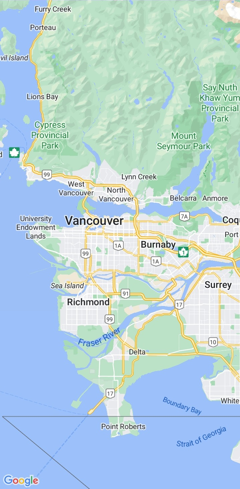
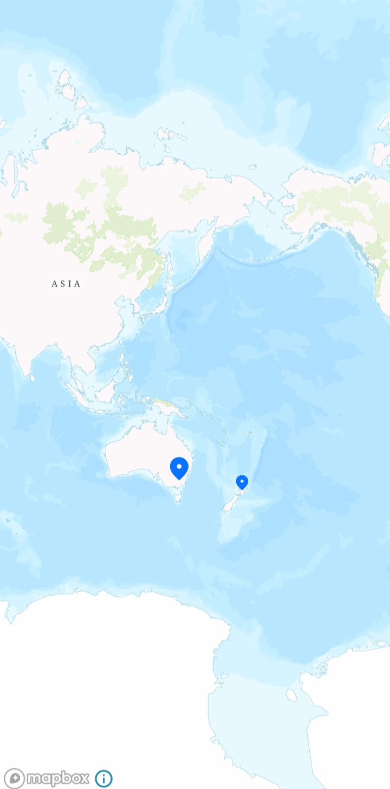
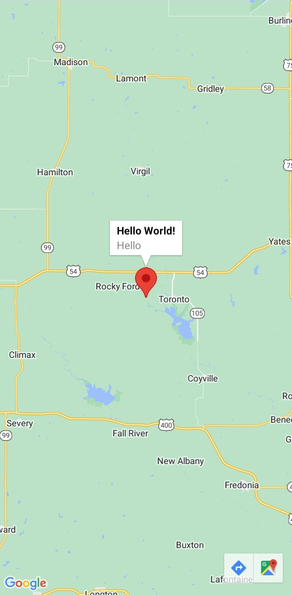
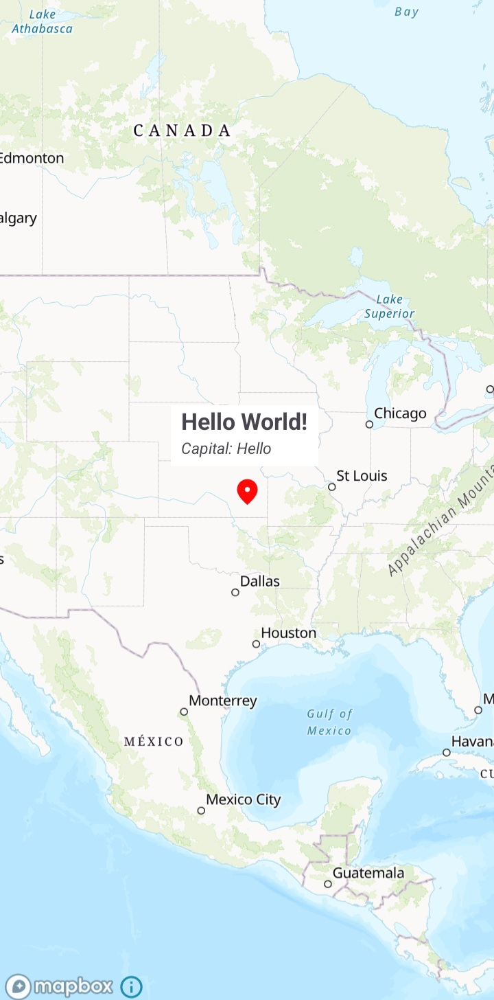
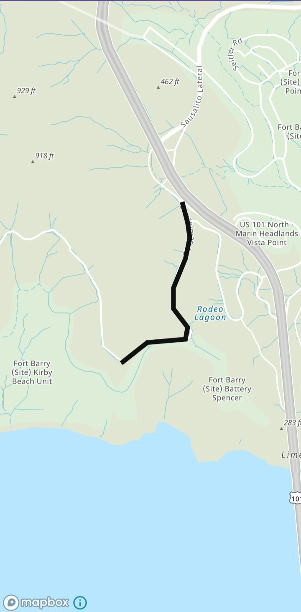

# Android - Migrating from Google Maps to Amazon Location Service

The [Amazon Location Demo](https://github.com/aws-geospatial/amazon-location-features-demo-android) open-source project can be used fully to gauge the in-depth capabilities of Amazon Location service

## Prerequisites:

1. Create an AWS account if you still need to create one. Once your AWS account is ready, you can create Amazon Location Service resources, which you will use to run the code snippets below.
2. Choose the map style that you want to use.
    1. In the Amazon Location Service console, on the [Maps page](https://console.aws.amazon.com/location/maps/home), choose Create Map to preview map styles.
    2. Add a Name and Description for the new map resource. Make a note of the name that you use for the map resource. You will need it when creating your script file later in the tutorial.
    3. Choose a map; remember that while choosing a map style, choose which map data provider you will use. For more information, see section 82 of the [AWS service terms](http://aws.amazon.com/service-terms).
    4. Agree to the [Amazon Location Terms and Conditions](https://aws.amazon.com/service-terms/#:~:text=82.%20Amazon%20Location%20Service), then choose Create Map. You can interact with the map that you've chosen: zoom in, zoom out, or pan in any direction.
3. Choose the place index that you want to use.
    1. In the Amazon Location Service console on the [Place indexes page](https://us-east-1.console.aws.amazon.com/location/places/home?region=us-east-1), choose Create Place Index.
    2. Add a Name and Description for the new place index resource. Make a note of the name that you use for the place index resource. You will need it when creating your script file later in the tutorial.
    3. Choose a data provider; in most cases, choose the one that matches your chosen map provider. This helps to ensure that the searches will match the maps. For more information, see section 82 of the [AWS service terms](http://aws.amazon.com/service-terms).
    4. Choose the Data storage option. Since no data is stored for this tutorial, you can choose No, single use only.
    5. Agree to the [Amazon Location Terms and Conditions](https://aws.amazon.com/service-terms/#:~:text=82.%20Amazon%20Location%20Service), then choose Create Place Index.
4. Choose the route calculator that you want to use.
    1. In the Amazon Location Service console on the [Route calculators page](https://us-east-1.console.aws.amazon.com/location/routes/home?region=us-east-1#/), choose Create Route Calculator.
    2. Add a Name and Description for the new route calculator resource. Make a note of the name that you use for the route calculator resource. You will need it when creating your script file later in the tutorial.
    3. Choose a data provider; remember that while choosing a map style, also select which map data provider you will use. For more information, see section 82 of the [AWS service terms](http://aws.amazon.com/service-terms).
    4. Agree to the [Amazon Location Terms and Conditions](https://aws.amazon.com/service-terms/#:~:text=82.%20Amazon%20Location%20Service), then choose Create Route Calculator.
5. To set up authentication for your application
    1. Go to the [Amazon Location console](https://us-east-1.console.aws.amazon.com/location/home?region=us-east-1#/), and choose API keys from the left menu.
    2. Choose Create API key; remember that the API key you create must be in the same AWS account and AWS Region as the Amazon Location Service resources you created in the previous section.
    3. Fill in the following information on the Create API key page.
        1. Name – A name for your API key, such as MyAppKey.
        2. Resources – Choose the Amazon Location Service Map and Place index resources you created in the previous section. You can add more than one resource by choosing Add Resource. By doing this, the API key will be permitted to be used with the specified resources.
        3. Actions – Specify the actions you want to authorize with this API key. You must select at least `geo:GetMap`, `geo:SearchPlaceIndexfForPosition`, and `geo:CalculateRoute` so that the tutorial will work as expected.
        4. You can optionally add a Description, Expiration time, or Tags to your API key. You can also add a referer (such as `.example.com`), to limit the key to only being used from a particular domain. This will mean that the tutorial will only work from that domain.
    4. Choose Create API Key to create the API key.
    5. Choose the Show API Key and copy the key value for use later in the tutorial. It will be in the form of `v1.public.a1b2c3d4....`

## Key features support:

<table style="border: 1px solid white">
      <thead>
            <tr>
                  <th style="text-align: center;">Features</th>
                  <th style="text-align: center;">Google Maps with SDK</th>
                  <th style="text-align: center;">Amazon Location with SDK</th>
            </tr>
      </thead>
      <tbody>
            <tr>
                  <td style="text-align: left;">Markers</td>
                  <td style="text-align: center;">✓</td>
                  <td style="text-align: center;">✓</td>
            </tr>
            <tr>
                  <td style="text-align: left;">Marker clustering</td>
                  <td style="text-align: center;">✓</td>
                  <td style="text-align: center;">✓</td>
            </tr>
            <tr>
                  <td style="text-align: left;">Polylines & Polygons</td>
                  <td style="text-align: center;">✓</td>
                  <td style="text-align: center;">✓</td>
            </tr>
            <tr>
                  <td style="text-align: left;">Data layers</td>
                  <td style="text-align: center;">✓</td>
                  <td style="text-align: center;">✓</td>
            </tr>
            <tr>
                  <td style="text-align: left;">Ground Overlays</td>
                  <td style="text-align: center;">✓</td>
                  <td style="text-align: center;">✓</td>
            </tr>
            <tr>
                  <td style="text-align: left;">Heat maps</td>
                  <td style="text-align: center;">✓</td>
                  <td style="text-align: center;">✓</td>
            </tr>
            <tr>
                  <td style="text-align: left;">Tile Layers</td>
                  <td style="text-align: center;">✓</td>
                  <td style="text-align: center;">✓</td>
            </tr>
            <tr>
                  <td style="text-align: left;">KML Layer</td>
                  <td style="text-align: center;">✓</td>
                  <td style="text-align: center;">✓</td>
            </tr>
            <tr>
                  <td style="text-align: left;">Drawing tools</td>
                  <td style="text-align: center;">✓</td>
                  <td style="text-align: center;">✓</td>
            </tr>
            <tr>
                  <td style="text-align: left;">Geocoder service</td>
                  <td style="text-align: center;">✓</td>
                  <td style="text-align: center;">✓</td>
            </tr>
            <tr>
                  <td style="text-align: left;">Routing service</td>
                  <td style="text-align: center;">✓</td>
                  <td style="text-align: center;">✓</td>
            </tr>
            <tr>
                  <td style="text-align: left;">Route Matrix service</td>
                  <td style="text-align: center;">✓</td>
                  <td style="text-align: center;">✓</td>
            </tr>
      </tbody>
</table>

## **Notable differences in the Android SDKs**

* Coordinates in Google Maps are referred to as `latitude, longitude`, while Amazon Location Service uses `longitude, latitude`. The Amazon Location Service format is aligned with the standard `[x, y]`, which is followed by most Geographic Information System (GIS) platforms.
* Coordinates in Amazon Location Maps are defined as Position objects. A coordinate is specified as a number array in the format of `[longitude, latitude]`.
* The APIs and SDK of Amazon Location Service seamlessly collaborate with the [MapLibre](https://github.com/maplibre/maplibre-native) SDK.
* The MapLibre Native SDK for Android is a library based on [Mapbox Native](https://github.com/mapbox/mapbox-gl-native) and is compatible with the styles and tiles provided by the Amazon Location Service Maps API. You can integrate MapLibre Native SDK for Android to embed interactive map views with scalable, customizable vector maps in your Android applications.

## Android SDK side-by-side examples

### Load a map

Both Google Maps and Amazon Location Service allow you to integrate interactive, customizable maps into your applications. These maps can display various types of geographical data and allow for features like panning and zooming.

1. The `SupportMapFragment` object manages the life cycle of the map and is the parent element of the app's UI. The `GoogleMap` object provides access to the map data and view. This is the main class of the Google Maps SDK for Android.
2. Amazon Location's MapLibre provides `MapView` to initialize and load the map.

#### With Google Maps

To display a map using the Google Maps SDK for Android, the following steps would be done:

**Step 1**: In Android Studio, open your app-level `build.gradle` file and update it as below.


```
plugins {
    id("com.android.application")
    id("org.jetbrains.kotlin.android")
    id("com.google.android.libraries.mapsplatform.secrets-gradle-plugin")
}

android {
    namespace = "com.example.googlemaptest"
    compileSdk = 34

    defaultConfig {
        applicationId = "com.example.googlemaptest"
        minSdk = 24
        targetSdk = 34
        versionCode = 1
        versionName = "1.0"

        testInstrumentationRunner = "androidx.test.runner.AndroidJUnitRunner"
    }

    buildTypes {
        release {
            isMinifyEnabled = false
            proguardFiles(
                getDefaultProguardFile("proguard-android-optimize.txt"),
                "proguard-rules.pro",
            )
        }
    }
    compileOptions {
        sourceCompatibility = JavaVersion.VERSION_1_8
        targetCompatibility = JavaVersion.VERSION_1_8
    }
    kotlinOptions {
        jvmTarget = "1.8"
    }
    buildFeatures {
        viewBinding = true
    }
}

dependencies {
    implementation("com.google.android.material:material:1.10.0")
    implementation("androidx.constraintlayout:constraintlayout:2.1.4")

    implementation("com.google.android.gms:play-services-maps:18.2.0")
    implementation("com.google.maps.android:android-maps-utils:3.7.0")
    implementation("com.squareup.okhttp3:okhttp:4.11.0")
}
```

**Step 2**: Save the file and [sync your project with Gradle](https://developer.android.com/studio/build#sync-files).

**Step 3**: In your `AndroidManifest.xml` file enter the below code and replace `MAPS_API_KEY` with your Google Maps API key:

```
<meta-data
    android:name="com.google.android.geo.API_KEY"
    android:value="MAPS_API_KEY" />    
```

**Step 4**: Add the below code to `activity_maps.xml` the file.

```
<?xml version="1.0" encoding="utf-8"?>
<fragment xmlns:android="http://schemas.android.com/apk/res/android"
    xmlns:map="http://schemas.android.com/apk/res-auto"
    xmlns:tools="http://schemas.android.com/tools"
    android:id="@+id/map"
    android:name="com.google.android.gms.maps.SupportMapFragment"
    android:layout_width="match_parent"
    android:layout_height="match_parent" />
```

**Step 5**: Add the below code to `MapsActivity.kt`.

```
class MapsActivity : AppCompatActivity(), OnMapReadyCallback {

    private lateinit var mMap: GoogleMap
    private lateinit var binding: ActivityMapsBinding

    override fun onCreate(savedInstanceState: Bundle?) {
        super.onCreate(savedInstanceState)

        binding = ActivityMapsBinding.inflate(layoutInflater)
        setContentView(binding.root)

        val mapFragment = supportFragmentManager
            .findFragmentById(R.id.map) as SupportMapFragment
        mapFragment.getMapAsync(this)
    }

    override fun onMapReady(googleMap: GoogleMap) {
        mMap = googleMap
        mMap.animateCamera(
            CameraUpdateFactory.newLatLngZoom(
                LatLng(
                    49.246559,
                    -123.063554,
                ),
                10.0f,
            ),
        )
    }
}
```



#### With Amazon Location

Loading a map in an Android app using Amazon Maps consists of the following steps:

**Step 1**: open your module-level `build.gradle` file and add the following `dependencies`.

```
plugins {
    id("com.android.application")
    id("org.jetbrains.kotlin.android")
}

android {
    namespace = "com.example.amazonmaptest"
    compileSdk = 34

    defaultConfig {
        applicationId = "com.example.amazonmaptest"
        minSdk = 24
        targetSdk = 34
        versionCode = 1
        versionName = "1.0"

        testInstrumentationRunner = "androidx.test.runner.AndroidJUnitRunner"
    }

    buildTypes {
        release {
            isMinifyEnabled = false
            proguardFiles(
                getDefaultProguardFile("proguard-android-optimize.txt"),
                "proguard-rules.pro",
            )
        }
    }
    compileOptions {
        sourceCompatibility = JavaVersion.VERSION_1_8
        targetCompatibility = JavaVersion.VERSION_1_8
    }
    kotlinOptions {
        jvmTarget = "1.8"
    }
    buildFeatures {
        viewBinding = true
    }
}
dependencies {
    implementation("com.google.android.material:material:1.10.0")
    implementation("androidx.constraintlayout:constraintlayout:2.1.4")

    implementation("org.maplibre.gl:android-sdk:9.6.0")
    implementation("org.maplibre.gl:android-plugin-annotation-v9:1.0.0")
}
```

**Step 2**: To configure your application with your resources and AWS Region inside `configuration.xml` file like the below:

```
<?xml version="1.0" encoding="utf-8"?>
<resources>
    <string name="identityPoolId">Your Identity Pool Id</string>
    <string name="mapName">Your Map name</string>
    <string name="awsRegion">Your Region</string>
    <string name="apiKey">Your API key</string>
</resources>
```

**Step 3**: Add the below permission inside the `AndroidManifest.xml` file:

```
<?xml version="1.0" encoding="utf-8"?>
<manifest xmlns:android="http://schemas.android.com/apk/res/android"
    xmlns:tools="http://schemas.android.com/tools">

    <uses-permission android:name="android.permission.INTERNET" />
    <uses-permission android:name="android.permission.ACCESS_NETWORK_STATE" />

    ...

</manifest>
```

**Step 4**: Add the below code inside `activity_map_load.xml` file.

```
<?xml version="1.0" encoding="utf-8"?>
<com.mapbox.mapboxsdk.maps.MapView xmlns:android="http://schemas.android.com/apk/res/android"
    xmlns:app="http://schemas.android.com/apk/res-auto"
    android:id="@+id/mapView"
    android:layout_width="match_parent"
    android:layout_height="match_parent"
    app:mapbox_foregroundLoadColor="@color/white"
    app:mapbox_renderTextureMode="true"
    app:mapbox_renderTextureTranslucentSurface="true" />
```

**Step 5**: Add the following code to your `MapActivity.kt` file.

```
class MapActivity : AppCompatActivity(), OnMapReadyCallback {

    private lateinit var mBinding: ActivityMapLoadBinding
    
    override fun onCreate(savedInstanceState: Bundle?) {
        super.onCreate(savedInstanceState)
        Mapbox.getInstance(this@MapActivity)
        mBinding = ActivityMapLoadBinding.inflate(layoutInflater)
        setContentView(mBinding.root)
        mBinding.mapView.onCreate(savedInstanceState)
        mBinding.mapView.getMapAsync(this)
    }

    override fun onStart() {
        super.onStart()
        mBinding.mapView.onStart()
    }

    override fun onResume() {
        super.onResume()
        mBinding.mapView.onResume()
    }

    override fun onPause() {
        super.onPause()
        mBinding.mapView.onPause()
    }

    override fun onStop() {
        super.onStop()
        mBinding.mapView.onStop()
    }

    override fun onSaveInstanceState(outState: Bundle) {
        super.onSaveInstanceState(outState)
        mBinding.mapView.onSaveInstanceState(outState)
    }

    override fun onLowMemory() {
        super.onLowMemory()
        mBinding.mapView.onLowMemory()
    }

    override fun onDestroy() {
        super.onDestroy()
        mBinding.mapView.onDestroy()
    }

    override fun onMapReady(mapboxMap: MapboxMap) {
        mapboxMap.setStyle(Style.Builder().fromUri("https://maps.geo.${getString(R.string.awsRegion)}.amazonaws.com/maps/v0/maps/${getString(R.string.mapName)}/style-descriptor?key=${getString(R.string.apiKey)}")) {
            mapboxMap.cameraPosition = CameraPosition.Builder().target(LatLng(49.246559, -123.063554)).zoom(10.0).build()
        }
    }
}
```


### How to add a marker?

Both Google Maps and Amazon Location Service can plot markers at specific coordinates on a map.

1. Google Maps supports it natively out of the box via `addMarker`.
2. Amazon Location Service utilizes the MapLibre library to render markers onto the map via `SymbolManager`.

#### With Google Maps

**Step 1**: With Google Maps, markers are added using the maps `addMarker` method in `MarkerActivity.kt`.

```
class MarkerActivity : AppCompatActivity(), OnMapReadyCallback {

    private lateinit var mMap: GoogleMap
    private lateinit var binding: ActivityMapsBinding

    override fun onCreate(savedInstanceState: Bundle?) {
        super.onCreate(savedInstanceState)

        binding = ActivityMapsBinding.inflate(layoutInflater)
        setContentView(binding.root)

        val mapFragment = supportFragmentManager
            .findFragmentById(R.id.map) as SupportMapFragment
        mapFragment.getMapAsync(this)
    }

    override fun onMapReady(googleMap: GoogleMap) {
        mMap = googleMap
        val latLng = LatLng(
            49.246559,
            -123.063554,
        )
        mMap.addMarker(MarkerOptions().position(latLng))
        mMap.animateCamera(
            CameraUpdateFactory.newLatLngZoom(
                latLng,
                10.0f,
            ),
        )
    }
}
```


#### With Amazon Location

**Step 1**: Add the below code inside `activity_add_marker.xml` file.

```
<?xml version="1.0" encoding="utf-8"?>
<com.mapbox.mapboxsdk.maps.MapView xmlns:android="http://schemas.android.com/apk/res/android"
    xmlns:app="http://schemas.android.com/apk/res-auto"
    android:id="@+id/mapView"
    android:layout_width="match_parent"
    android:layout_height="match_parent"
    app:mapbox_foregroundLoadColor="@color/white"
    app:mapbox_renderTextureMode="true"
    app:mapbox_renderTextureTranslucentSurface="true" />
```

**Step 2**: Add a marker drawable named `ic_marker_blue` to the drawable folder and insert the below code into `AddMarkerActivity.kt`.

```
class AddMarkerActivity : AppCompatActivity(), OnMapReadyCallback {

    private lateinit var mBinding: ActivityAddMarkerBinding
    
    override fun onCreate(savedInstanceState: Bundle?) {
        super.onCreate(savedInstanceState)
        Mapbox.getInstance(this@AddMarkerActivity)
        mBinding = ActivityAddMarkerBinding.inflate(layoutInflater)
        setContentView(mBinding.root)
        mBinding.mapView.onCreate(savedInstanceState)
        mBinding.mapView.getMapAsync(this)
    }

    override fun onStart() {
        super.onStart()
        mBinding.mapView.onStart()
    }

    override fun onResume() {
        super.onResume()
        mBinding.mapView.onResume()
    }

    override fun onPause() {
        super.onPause()
        mBinding.mapView.onPause()
    }

    override fun onStop() {
        super.onStop()
        mBinding.mapView.onStop()
    }

    override fun onSaveInstanceState(outState: Bundle) {
        super.onSaveInstanceState(outState)
        mBinding.mapView.onSaveInstanceState(outState)
    }

    override fun onLowMemory() {
        super.onLowMemory()
        mBinding.mapView.onLowMemory()
    }

    override fun onDestroy() {
        super.onDestroy()
        mBinding.mapView.onDestroy()
    }

    override fun onMapReady(mapboxMap: MapboxMap) {
        mapboxMap.setStyle(Style.Builder().fromUri("https://maps.geo.${getString(R.string.awsRegion)}.amazonaws.com/maps/v0/maps/${getString(R.string.mapName)}/style-descriptor?key=${getString(R.string.apiKey)}")) {
            mapboxMap.cameraPosition = CameraPosition.Builder().target(LatLng(49.246559, -123.063554)).zoom(9.0).build()
            addMarker(mBinding.mapView, mapboxMap, this, "marker-name")
        }
    }
    
    private fun addMarker(mapView: MapView, mapboxMap: MapboxMap?, activity: Activity, name: String) {
        mapboxMap?.getStyle { style ->
            val symbolManager = SymbolManager(mapView, mapboxMap, style)
            ContextCompat.getDrawable(activity.baseContext, R.drawable.ic_marker_blue)?.let {
                style.addImage(name, it)
            }
            symbolManager.create(SymbolOptions().withLatLng(LatLng(49.246559, -123.063554)).withIconImage(name).withIconAnchor(Property.ICON_ANCHOR_CENTER))
        }
    }
}
```


### Marker clustering

Both Google Maps and Amazon Location Service provide marker clustering.

1. Google Maps provides `ClusterManager` that takes the map reference and an array of markers to show marker clusters on the map.
2. Amazon Location Service renders markers and data layers directly from MapLibre via `addSource` and `addLayer`.

#### With Google Maps

**Step 1**: Add the below line inside the `dependencies` in the `build.gradle` file and click on Sync now.

```
implementation("com.google.maps.android:android-maps-utils:3.7.0")
```

**Step 2**: Add the below code inside `MarkerClusterActivity.kt`.


```
class MarkerClusterActivity : AppCompatActivity(), OnMapReadyCallback {

    private lateinit var mMap: GoogleMap
    private lateinit var binding: ActivityMapsBinding
    private lateinit var clusterManager: ClusterManager<MyItem>

    override fun onCreate(savedInstanceState: Bundle?) {
        super.onCreate(savedInstanceState)

        binding = ActivityMapsBinding.inflate(layoutInflater)
        setContentView(binding.root)

        val mapFragment = supportFragmentManager
            .findFragmentById(R.id.map) as SupportMapFragment
        mapFragment.getMapAsync(this)
    }

    override fun onMapReady(googleMap: GoogleMap) {
        mMap = googleMap
        setUpCluster()
    }

    private fun setUpCluster() {
        mMap.moveCamera(CameraUpdateFactory.newLatLngZoom(LatLng(-28.024, 140.887), 3f))

        clusterManager = ClusterManager(applicationContext, mMap)

        mMap.setOnCameraIdleListener(clusterManager)
        mMap.setOnMarkerClickListener(clusterManager)
        addItems()
    }

    private fun addItems() {
        clusterManager.addItem(MyItem(-31.56391, 147.154312, "Title1", "Snippet1"))
        clusterManager.addItem(MyItem(-33.71823, 150.363181, "Title2", "Snippet2"))
        clusterManager.addItem(MyItem(-33.72711, 150.371124, "Title3", "Snippet3"))
        clusterManager.addItem(MyItem(-33.84858, 151.209834, "Title4", "Snippet4"))
        clusterManager.addItem(MyItem(-33.85170, 151.216968, "Title5", "Snippet5"))
        clusterManager.addItem(MyItem(-34.67126, 150.863657, "Title6", "Snippet6"))
        clusterManager.addItem(MyItem(-35.30472, 148.662905, "Title7", "Snippet7"))
        clusterManager.addItem(MyItem(-36.81768, 175.699196, "Title8", "Snippet8"))
        clusterManager.addItem(MyItem(-36.82861, 175.790222, "Title9", "Snippet9"))
        clusterManager.addItem(MyItem(-37.75, 145.116667, "Title10", "Snippet10"))
        clusterManager.addItem(MyItem(-37.75985, 145.128708, "Title11", "Snippet11"))
        clusterManager.addItem(MyItem(-37.76501, 145.133858, "Title12", "Snippet12"))
        clusterManager.addItem(MyItem(-37.77010, 145.143299, "Title13", "Snippet13"))
        clusterManager.addItem(MyItem(-37.7737, 45.145187, "Title14", "Snippet14"))
        clusterManager.addItem(MyItem(-37.77478, 145.137978, "Title15", "Snippet15"))
        clusterManager.addItem(MyItem(-37.81961, 144.968119, "Title16", "Snippet16"))
    }

    inner class MyItem(
        lat: Double,
        lng: Double,
        title: String,
        snippet: String,
    ) : ClusterItem {

        private val position: LatLng
        private val title: String
        private val snippet: String

        override fun getPosition(): LatLng {
            return position
        }

        override fun getTitle(): String {
            return title
        }

        override fun getSnippet(): String {
            return snippet
        }

        override fun getZIndex(): Float {
            return 0f
        }

        init {
            position = LatLng(lat, lng)
            this.title = title
            this.snippet = snippet
        }
    }
}
```

    

#### With Amazon Location

**Step 1**: Add the code below inside `activity_marker_cluster.xml`.

```
<?xml version="1.0" encoding="utf-8"?>
<com.mapbox.mapboxsdk.maps.MapView xmlns:android="http://schemas.android.com/apk/res/android"
    xmlns:app="http://schemas.android.com/apk/res-auto"
    android:id="@+id/mapView"
    android:layout_width="match_parent"
    android:layout_height="match_parent"
    app:mapbox_foregroundLoadColor="@color/white"
    app:mapbox_renderTextureMode="true"
    app:mapbox_renderTextureTranslucentSurface="true" />
```

**Step 2**: Include the following code to `MarkerClusterActivity.kt`.

```
class MarkerClusterActivity : AppCompatActivity(), OnMapReadyCallback {

    private lateinit var mBinding: ActivityMarkerClusterBinding
    private val CLUSTER_SOURCE_ID = "cluster-source"
    private val ICON_ID = "single-icon-id"
    private val geoJsonString = "{\n" +
        "  \"type\": \"FeatureCollection\",\n" +
        "  \"features\": [\n" +
        "    { \"type\": \"Feature\", \"properties\": { \"id\": \"ak16994521\", \"mag\": 2.3, \"time\": 1507425650893, \"felt\": null, \"tsunami\": 0 }, \"geometry\": { \"type\": \"Point\", \"coordinates\": [ 147.154312, -31.56391, 0.0 ] } },\n" +
        "{ \"type\": \"Feature\", \"properties\": { \"id\": \"ak16994519\", \"mag\": 1.7, \"time\": 1507425289659, \"felt\": null, \"tsunami\": 0 }, \"geometry\": { \"type\": \"Point\", \"coordinates\": [ 150.363181, -33.718234, 105.5 ] } },\n" +
        "{ \"type\": \"Feature\", \"properties\": { \"id\": \"ak16994517\", \"mag\": 1.6, \"time\": 1507424832518, \"felt\": null, \"tsunami\": 0 }, \"geometry\": { \"type\": \"Point\", \"coordinates\": [ 150.371124, -33.727111, 0.0 ] } },\n" +
        "{ \"type\": \"Feature\", \"properties\": { \"id\": \"ak16994510\", \"mag\": 1.6, \"time\": 1507422449194, \"felt\": null, \"tsunami\": 0 }, \"geometry\": { \"type\": \"Point\", \"coordinates\": [ 151.209834, -33.848588, 0.0 ] } },\n" +
        "{ \"type\": \"Feature\", \"properties\": { \"id\": \"ak16994298\", \"mag\": 2.4, \"time\": 1507419370097, \"felt\": null, \"tsunami\": 0 }, \"geometry\": { \"type\": \"Point\", \"coordinates\": [ 151.216968, -33.851702, 7.5 ] } },\n" +
        "{ \"type\": \"Feature\", \"properties\": { \"id\": \"ak16994293\", \"mag\": 1.5, \"time\": 1507417256497, \"felt\": null, \"tsunami\": 0 }, \"geometry\": { \"type\": \"Point\", \"coordinates\": [ 150.863657, -34.671264, 10.8 ] } },\n" +
        "{ \"type\": \"Feature\", \"properties\": { \"id\": \"ak16994287\", \"mag\": 2.0, \"time\": 1507413903714, \"felt\": null, \"tsunami\": 0 }, \"geometry\": { \"type\": \"Point\", \"coordinates\": [ 148.662905, -35.304724, 0.0 ] } },\n" +
        "{ \"type\": \"Feature\", \"properties\": { \"id\": \"ak16994285\", \"mag\": 1.5, \"time\": 1507413670029, \"felt\": null, \"tsunami\": 0 }, \"geometry\": { \"type\": \"Point\", \"coordinates\": [ 175.699196, -36.817685, 96.8 ] } },\n" +
        "{ \"type\": \"Feature\", \"properties\": { \"id\": \"ak16994280\", \"mag\": 1.3, \"time\": 1507413266231, \"felt\": null, \"tsunami\": 0 }, \"geometry\": { \"type\": \"Point\", \"coordinates\": [ 175.790222, -36.828611, 54.3 ] } },\n" +
        "{ \"type\": \"Feature\", \"properties\": { \"id\": \"ak16994278\", \"mag\": 1.8, \"time\": 1507413195076, \"felt\": null, \"tsunami\": 0 }, \"geometry\": { \"type\": \"Point\", \"coordinates\": [ 145.116667, -37.75, 50.0 ] } },\n" +
        "{ \"type\": \"Feature\", \"properties\": { \"id\": \"ak16994273\", \"mag\": 1.2, \"time\": 1507411925999, \"felt\": null, \"tsunami\": 0 }, \"geometry\": { \"type\": \"Point\", \"coordinates\": [ 145.128708, -37.759859, 69.1 ] } },\n" +
        "{ \"type\": \"Feature\", \"properties\": { \"id\": \"ak16994270\", \"mag\": 2.0, \"time\": 1507411814209, \"felt\": null, \"tsunami\": 0 }, \"geometry\": { \"type\": \"Point\", \"coordinates\": [ 145.133858, -37.765015, 14.8 ] } },\n" +
        "{ \"type\": \"Feature\", \"properties\": { \"id\": \"ak16993963\", \"mag\": 1.4, \"time\": 1507407100665, \"felt\": null, \"tsunami\": 0 }, \"geometry\": { \"type\": \"Point\", \"coordinates\": [ 145.143299, -37.770104, 150.4 ] } },\n" +
        "{ \"type\": \"Feature\", \"properties\": { \"id\": \"ak16993960\", \"mag\": 1.4, \"time\": 1507405129739, \"felt\": null, \"tsunami\": 0 }, \"geometry\": { \"type\": \"Point\", \"coordinates\": [ 145.145187, -37.7737, 26.9 ] } },\n" +
        "{ \"type\": \"Feature\", \"properties\": { \"id\": \"ak16993952\", \"mag\": 1.7, \"time\": 1507403679922, \"felt\": null, \"tsunami\": 0 }, \"geometry\": { \"type\": \"Point\", \"coordinates\": [ 145.137978, -37.774785, 34.2 ] } },\n" +
        "{ \"type\": \"Feature\", \"properties\": { \"id\": \"ak16993746\", \"mag\": 1.3, \"time\": 1507399350671, \"felt\": null, \"tsunami\": 0 }, \"geometry\": { \"type\": \"Point\", \"coordinates\": [ 144.968119, -37.819616, 3.3 ] } },\n" +
        "{ \"type\": \"Feature\", \"properties\": { \"id\": \"ak16993741\", \"mag\": 1.6, \"time\": 1507398797233, \"felt\": null, \"tsunami\": 0 }, \"geometry\": { \"type\": \"Point\", \"coordinates\": [ 144.695692, -38.330766, 0.0 ] } }\n" +
        "  ]\n" +
        "}\n"

    override fun onCreate(savedInstanceState: Bundle?) {
        super.onCreate(savedInstanceState)
        Mapbox.getInstance(this@MarkerClusterActivity)
        mBinding = ActivityMarkerClusterBinding.inflate(layoutInflater)
        setContentView(mBinding.root)
        mBinding.mapView.onCreate(savedInstanceState)
        mBinding.mapView.getMapAsync(this)
    }

    override fun onStart() {
        super.onStart()
        mBinding.mapView.onStart()
    }

    override fun onResume() {
        super.onResume()
        mBinding.mapView.onResume()
    }

    override fun onPause() {
        super.onPause()
        mBinding.mapView.onPause()
    }

    override fun onStop() {
        super.onStop()
        mBinding.mapView.onStop()
    }

    override fun onSaveInstanceState(outState: Bundle) {
        super.onSaveInstanceState(outState)
        mBinding.mapView.onSaveInstanceState(outState)
    }

    override fun onLowMemory() {
        super.onLowMemory()
        mBinding.mapView.onLowMemory()
    }

    override fun onDestroy() {
        super.onDestroy()
        mBinding.mapView.onDestroy()
    }

    override fun onMapReady(mapboxMap: MapboxMap) {
        mapboxMap.setStyle(Style.Builder().fromUri("https://maps.geo.${getString(R.string.awsRegion)}.amazonaws.com/maps/v0/maps/${getString(R.string.mapName)}/style-descriptor?key=${getString(R.string.apiKey)}")) { style ->
            mapboxMap.cameraPosition = CameraPosition.Builder().target(LatLng(-37.759859, 145.128708)).zoom(7.0).build()
            style.transition = TransitionOptions(0, 0, false)
            initLayerIcons(style)
            addClusteredGeoJsonSource(style)
        }
    }

    private fun initLayerIcons(loadedMapStyle: Style) {
        BitmapUtils.getBitmapFromDrawable(ContextCompat.getDrawable(applicationContext, R.drawable.ic_marker_blue))?.let {
            loadedMapStyle.addImage(ICON_ID, it)
        }
    }

    private fun addClusteredGeoJsonSource(loadedMapStyle: Style) {
        try {
            val geoJsonOptions = GeoJsonOptions().withBuffer(16)
            loadedMapStyle.addSource(GeoJsonSource(CLUSTER_SOURCE_ID, geoJsonString, geoJsonOptions))
        } catch (_: URISyntaxException) {
        }
        val unClusteredSymbolLayer =
            SymbolLayer("unclustered-points", CLUSTER_SOURCE_ID).withProperties(iconImage(ICON_ID), iconSize(division(get("mag"), literal(4.0f))))
        unClusteredSymbolLayer.setFilter(has("mag"))

        loadedMapStyle.addLayer(unClusteredSymbolLayer)
    }
}
```

    

### Display an Info window

Both Google Maps and Amazon Location Service can render an info/popup on the map.

1. Google Maps uses `MarkerOptions` to display a popup next to a marker.
2. Amazon Location Service utilizes the MapLibre library. You can use the `addSource` and `addLayer` methods to add GeoJSON data.

#### With Google Maps

**Step 1**: Add the code below inside `InfoWindowActivity.kt`.

```
class InfoWindowActivity : AppCompatActivity(), OnMapReadyCallback {

    private lateinit var mMap: GoogleMap
    private lateinit var binding: ActivityMapsBinding

    override fun onCreate(savedInstanceState: Bundle?) {
        super.onCreate(savedInstanceState)

        binding = ActivityMapsBinding.inflate(layoutInflater)
        setContentView(binding.root)

        val mapFragment = supportFragmentManager
            .findFragmentById(R.id.map) as SupportMapFragment
        mapFragment.getMapAsync(this)
    }

    override fun onMapReady(googleMap: GoogleMap) {
        mMap = googleMap
        // Add a marker in Sydney and move the camera
        val latLng = LatLng(37.8, -96.0)
        mMap.addMarker(
            MarkerOptions().position(latLng).title("Hello World!")
                .snippet("Hello"),
        )
        mMap.animateCamera(
            CameraUpdateFactory.newLatLngZoom(
                latLng,
                10.0f,
            ),
        )
    }
}
```



#### With Amazon Location

**Step 1**: Add the below code inside  `activity_map_load.xml` file.

```
<?xml version="1.0" encoding="utf-8"?>
<com.mapbox.mapboxsdk.maps.MapView xmlns:android="http://schemas.android.com/apk/res/android"
    xmlns:app="http://schemas.android.com/apk/res-auto"
    android:id="@+id/mapView"
    android:layout_width="match_parent"
    android:layout_height="match_parent"
    app:mapbox_foregroundLoadColor="@color/white"
    app:mapbox_renderTextureMode="true"
    app:mapbox_renderTextureTranslucentSurface="true" />.
```

**Step 2**: Include the following code to `InfoWindowActivity.kt`.

```
class InfoWindowActivity : AppCompatActivity(), OnMapReadyCallback, MapboxMap.OnMapClickListener {
    
    private lateinit var mBinding: ActivityMapLoadBinding
    private val GEOJSON_SOURCE_ID = "GEOJSON_SOURCE_ID"
    private val MARKER_IMAGE_ID = "MARKER_IMAGE_ID"
    private val MARKER_LAYER_ID = "MARKER_LAYER_ID"
    private val CALLOUT_LAYER_ID = "CALLOUT_LAYER_ID"
    private val PROPERTY_SELECTED = "selected"
    private val PROPERTY_NAME = "name"
    private val PROPERTY_CAPITAL = "capital"
    private var source: GeoJsonSource? = null
    private var featureCollection: FeatureCollection? = null
    private var map: MapboxMap? = null
    
    override fun onCreate(savedInstanceState: Bundle?) {
        super.onCreate(savedInstanceState)
        Mapbox.getInstance(this@InfoWindowActivity)
        mBinding = ActivityMapLoadBinding.inflate(layoutInflater)
        setContentView(mBinding.root)
        mBinding.mapView.onCreate(savedInstanceState)
        mBinding.mapView.getMapAsync(this)
    }

    override fun onStart() {
        super.onStart()
        mBinding.mapView.onStart()
    }

    override fun onResume() {
        super.onResume()
        mBinding.mapView.onResume()
    }

    override fun onPause() {
        super.onPause()
        mBinding.mapView.onPause()
    }

    override fun onStop() {
        super.onStop()
        mBinding.mapView.onStop()
    }

    override fun onSaveInstanceState(outState: Bundle) {
        super.onSaveInstanceState(outState)
        mBinding.mapView.onSaveInstanceState(outState)
    }

    override fun onLowMemory() {
        super.onLowMemory()
        mBinding.mapView.onLowMemory()
    }

    override fun onDestroy() {
        super.onDestroy()
        mBinding.mapView.onDestroy()
    }

    override fun onMapReady(mapboxMap: MapboxMap) {
        mapboxMap.setStyle(Style.Builder().fromUri("https://maps.geo.${getString(R.string.awsRegion)}.amazonaws.com/maps/v0/maps/${getString(R.string.mapName)}/style-descriptor?key=${getString(R.string.apiKey)}")) {
            map = mapboxMap
            mapboxMap.cameraPosition = CameraPosition.Builder().target(LatLng(37.8, -96.0)).zoom(3.0).build()
            val featureCollection = FeatureCollection.fromJson(
                "{\n" +
                    "  \"type\": \"FeatureCollection\",\n" +
                    "  \"features\": [\n" +
                    "    {\n" +
                    "      \"type\": \"Feature\",\n" +
                    "      \"properties\": {\n" +
                    "        \"marker-color\": \"#7e7e7e\",\n" +
                    "        \"marker-size\": \"medium\",\n" +
                    "        \"marker-symbol\": \"\",\n" +
                    "        \"name\": \"Hello World!\",\n" +
                    "        \"capital\": \"Hello\"\n" +
                    "      },\n" +
                    "      \"geometry\": {\n" +
                    "        \"type\": \"Point\",\n" +
                    "        \"coordinates\": [\n" +
                    "          -96.0,\n" +
                    "          37.8\n" +
                    "        ]\n" +
                    "      }\n" +
                    "    }\n" +
                    "  ]\n" +
                    "}",
            )
            for (singleFeature in featureCollection.features()!!) {
                singleFeature.addBooleanProperty("selected", false)
            }
            setUpData(featureCollection)

            val viewMap = HashMap<String, View>()
            val imagesMap = HashMap<String, Bitmap>()
            val inflater = LayoutInflater.from(this)
            if (featureCollection != null) {
                for (feature in featureCollection.features()!!) {
                    val layout = inflater.inflate(R.layout.symbol_layer_info_window_layout_callout, null) as LinearLayout
                    val name = feature.getStringProperty(PROPERTY_NAME)
                    val titleTextView = layout.findViewById<TextView>(R.id.info_window_title)
                    titleTextView.text = name
                    val style = feature.getStringProperty(PROPERTY_CAPITAL)
                    val descriptionTextView = layout.findViewById<TextView>(R.id.info_window_description)
                    descriptionTextView.text = java.lang.String.format(getString(R.string.capital), style)
                    val measureSpec = View.MeasureSpec.makeMeasureSpec(0, View.MeasureSpec.UNSPECIFIED)
                    layout.measure(measureSpec, measureSpec)
                    val bitmap: Bitmap = SymbolGenerator.generate(layout)
                    imagesMap[name] = bitmap
                    viewMap[name] = layout
                }
            }
            setImageGenResults(imagesMap)
            refreshSource()
            mapboxMap.addOnMapClickListener(this@InfoWindowActivity)
        }
    }

    private fun setUpData(collection: FeatureCollection) {
        featureCollection = collection
        map?.getStyle { style ->
            setupSource(style)
            setUpImage(style)
            setUpMarkerLayer(style)
            setUpInfoWindowLayer(style)
        }
    }

    private fun setupSource(loadedStyle: Style) {
        source = GeoJsonSource(GEOJSON_SOURCE_ID, featureCollection)
        loadedStyle.addSource(source!!)
    }

    private fun setUpImage(loadedStyle: Style) {
        ContextCompat.getDrawable(applicationContext, R.drawable.ic_marker_red)?.let {
            loadedStyle.addImage(MARKER_IMAGE_ID, it)
        }
    }

    private fun refreshSource() {
        if (source != null && featureCollection != null) {
            source!!.setGeoJson(featureCollection)
        }
    }

    private fun setUpMarkerLayer(loadedStyle: Style) {
        loadedStyle.addLayer(
            SymbolLayer(MARKER_LAYER_ID, GEOJSON_SOURCE_ID)
                .withProperties(iconImage(MARKER_IMAGE_ID), iconAllowOverlap(true), iconOffset(arrayOf(0f, -8f))),
        )
    }

    private fun setUpInfoWindowLayer(loadedStyle: Style) {
        loadedStyle.addLayer(
            SymbolLayer(CALLOUT_LAYER_ID, GEOJSON_SOURCE_ID)
                .withProperties(iconImage("{name}"), iconAnchor(ICON_ANCHOR_BOTTOM), iconAllowOverlap(true), iconOffset(arrayOf(-2f, -28f)))
                .withFilter(eq(get(PROPERTY_SELECTED), literal(true))),
        )
    }

    private fun handleClickIcon(screenPoint: PointF): Boolean {
        val features: List<Feature> =
            map!!.queryRenderedFeatures(screenPoint, MARKER_LAYER_ID)
        return if (features.isNotEmpty()) {
            val name: String = features[0].getStringProperty(PROPERTY_NAME)
            val featureList: List<Feature>? = featureCollection!!.features()
            if (featureList != null) {
                for (i in featureList.indices) {
                    if (featureList[i].getStringProperty(PROPERTY_NAME).equals(name)) {
                        if (featureSelectStatus(i)) {
                            setFeatureSelectState(featureList[i], false)
                        } else {
                            setSelected(i)
                        }
                    }
                }
            }
            true
        } else {
            false
        }
    }

    private fun setSelected(index: Int) {
        if (featureCollection!!.features() != null) {
            val feature = featureCollection!!.features()!![index]
            setFeatureSelectState(feature, true)
            refreshSource()
        }
    }

    private fun setFeatureSelectState(feature: Feature, selectedState: Boolean) {
        if (feature.properties() != null) {
            feature.properties()!!.addProperty(PROPERTY_SELECTED, selectedState)
            refreshSource()
        }
    }

    private fun featureSelectStatus(index: Int): Boolean {
        return if (featureCollection == null) {
            false
        } else {
            featureCollection!!.features()!![index].getBooleanProperty(PROPERTY_SELECTED)
        }
    }

    private fun setImageGenResults(imageMap: HashMap<String, Bitmap>?) {
        if (map != null) {
            map!!.getStyle { style ->
                if (imageMap != null) {
                    style.addImages(imageMap)
                }
            }
        }
    }

    private object SymbolGenerator {
        fun generate(view: View): Bitmap {
            val measureSpec = View.MeasureSpec.makeMeasureSpec(0, View.MeasureSpec.UNSPECIFIED)
            view.measure(measureSpec, measureSpec)
            val measuredWidth = view.measuredWidth
            val measuredHeight = view.measuredHeight
            view.layout(0, 0, measuredWidth, measuredHeight)
            val bitmap = Bitmap.createBitmap(measuredWidth, measuredHeight, Bitmap.Config.ARGB_8888)
            bitmap.eraseColor(Color.TRANSPARENT)
            val canvas = Canvas(bitmap)
            view.draw(canvas)
            return bitmap
        }
    }

    override fun onMapClick(point: LatLng): Boolean {
        return handleClickIcon(map!!.projection.toScreenLocation(point))
    }
}
```




### How to add a polyline?

Polylines can be drawn on Google Maps. For Amazon Location Service, there isn't any built-in support for polylines.

1. You can use Google Maps `addPolyline` method to draw polylines on a map.
2. Amazon Location Service utilizes the MapLibre library. You can use the `addSource` and `addLayer` methods to add GeoJSON data.

#### With Google Maps

**Step 1**: Add the code below inside `PolylineActivity.kt`.

```
class PolylineActivity : AppCompatActivity(), OnMapReadyCallback {

    private lateinit var mMap: GoogleMap
    private lateinit var binding: ActivityMapsBinding

    override fun onCreate(savedInstanceState: Bundle?) {
        super.onCreate(savedInstanceState)

        binding = ActivityMapsBinding.inflate(layoutInflater)
        setContentView(binding.root)

        val mapFragment = supportFragmentManager
            .findFragmentById(R.id.map) as SupportMapFragment
        mapFragment.getMapAsync(this)
    }

    override fun onMapReady(googleMap: GoogleMap) {
        mMap = googleMap
        mMap.addPolyline(
            PolylineOptions()
                .add(
                    LatLng(37.83381888486939, -122.48369693756104),
                    LatLng(37.83317489144141, -122.48348236083984),
                    LatLng(37.83270036637107, -122.48339653015138),
                    LatLng(37.832056363179625, -122.48356819152832),
                    LatLng(37.83114119107971, -122.48404026031496),
                    LatLng(37.83049717427869, -122.48404026031496),
                    LatLng(37.829920943955045, -122.48348236083984),
                    LatLng(37.82954808664175, -122.48356819152832),
                    LatLng(37.82944639795659, -122.48507022857666),
                    LatLng(37.82880236636284, -122.48610019683838),
                ),
        )
        mMap.animateCamera(
            CameraUpdateFactory.newLatLngZoom(
                LatLng(
                    37.830348,
                    -122.486052,
                ),
                15.0f,
            ),
        )
    }
}
```


#### With Amazon Location

**Step 1**: Add the below code inside `activity_polyline.xml`.

```
<?xml version="1.0" encoding="utf-8"?>
<com.mapbox.mapboxsdk.maps.MapView xmlns:android="http://schemas.android.com/apk/res/android"
    xmlns:app="http://schemas.android.com/apk/res-auto"
    android:id="@+id/mapView"
    android:layout_width="match_parent"
    android:layout_height="match_parent"
    app:mapbox_foregroundLoadColor="@color/white"
    app:mapbox_renderTextureMode="true"
    app:mapbox_renderTextureTranslucentSurface="true" />
```

**Step 2**: Include the following code to `PolylineActivity.kt`.

```
class PolylineActivity : AppCompatActivity(), OnMapReadyCallback {

    private lateinit var mBinding: ActivityPolylineBinding
    
    override fun onCreate(savedInstanceState: Bundle?) {
        super.onCreate(savedInstanceState)
        Mapbox.getInstance(this@PolylineActivity)
        mBinding = ActivityPolylineBinding.inflate(layoutInflater)
        setContentView(mBinding.root)
        mBinding.mapView.onCreate(savedInstanceState)
        mBinding.mapView.getMapAsync(this)
    }

    override fun onStart() {
        super.onStart()
        mBinding.mapView.onStart()
    }

    override fun onResume() {
        super.onResume()
        mBinding.mapView.onResume()
    }

    override fun onPause() {
        super.onPause()
        mBinding.mapView.onPause()
    }

    override fun onStop() {
        super.onStop()
        mBinding.mapView.onStop()
    }

    override fun onSaveInstanceState(outState: Bundle) {
        super.onSaveInstanceState(outState)
        mBinding.mapView.onSaveInstanceState(outState)
    }

    override fun onLowMemory() {
        super.onLowMemory()
        mBinding.mapView.onLowMemory()
    }

    override fun onDestroy() {
        super.onDestroy()
        mBinding.mapView.onDestroy()
    }

    override fun onMapReady(mapboxMap: MapboxMap) {
        mapboxMap.setStyle(Style.Builder().fromUri("https://maps.geo.${getString(R.string.awsRegion)}.amazonaws.com/maps/v0/maps/${getString(R.string.mapName)}/style-descriptor?key=${getString(R.string.apiKey)}")) { style ->
            mapboxMap.cameraPosition = CameraPosition.Builder().target(LatLng(37.830348, -122.486052)).zoom(15.0).build()
            addLine(
                style,
                listOf(
                    Point.fromLngLat(-122.48369693756104, 37.83381888486939),
                    Point.fromLngLat(-122.48348236083984, 37.83317489144141),
                    Point.fromLngLat(-122.48339653015138, 37.83270036637107),
                    Point.fromLngLat(-122.48356819152832, 37.832056363179625),
                    Point.fromLngLat(-122.48404026031496, 37.83114119107971),
                    Point.fromLngLat(-122.48404026031496, 37.83049717427869),
                    Point.fromLngLat(-122.48348236083984, 37.829920943955045),
                    Point.fromLngLat(-122.48356819152832, 37.82954808664175),
                    Point.fromLngLat(-122.48507022857666, 37.82944639795659),
                    Point.fromLngLat(-122.48610019683838, 37.82880236636284),
                ),
            )
        }
    }

    private fun addLine(
        style: Style,
        coordinates: List<Point>,
    ) {
        val mSourceId = "line-source"
        style.removeSource(mSourceId)
        val mLayerId = UUID.randomUUID().toString()
        val lineString: LineString = LineString.fromLngLats(coordinates)
        val feature: Feature = Feature.fromGeometry(lineString)

        val featureCollection = FeatureCollection.fromFeature(feature)
        val geoJsonSource = GeoJsonSource(mSourceId, featureCollection)
        style.addSource(geoJsonSource)

        style.addLayer(
            LineLayer(mLayerId, mSourceId).withProperties(PropertyFactory.lineDasharray(arrayOf()), PropertyFactory.lineWidth(6f), PropertyFactory.lineColor("#111")),
        )
    }
}
```



### How to add a polygon?

Polygons are geometric shapes that are used to represent a specific area on a map. The following examples show you how to create a polygon.

1. You can use Google Maps `addPolygon` method to draw a polygon on a map.
2. Amazon Location Service utilizes the MapLibre library. You can use the `addSource` and `addLayer` methods to add GeoJSON data.

#### With Google Maps

**Step 1**: Add the code below inside `PolygonActivity.kt`.

```
class PolygonActivity : AppCompatActivity(), OnMapReadyCallback {

    private lateinit var mMap: GoogleMap
    private lateinit var binding: ActivityMapsBinding

    override fun onCreate(savedInstanceState: Bundle?) {
        super.onCreate(savedInstanceState)

        binding = ActivityMapsBinding.inflate(layoutInflater)
        setContentView(binding.root)

        val mapFragment = supportFragmentManager
            .findFragmentById(R.id.map) as SupportMapFragment
        mapFragment.getMapAsync(this)
    }

    override fun onMapReady(googleMap: GoogleMap) {
        mMap = googleMap
        val polygon = mMap.addPolygon(
            PolygonOptions()
                .add(
                    LatLng(25.774, -80.19),
                    LatLng(18.466, -66.118),
                    LatLng(32.321, -64.757),
                    LatLng(25.774, -80.19),
                ),
        )
        polygon.fillColor = -0xa80e9
        polygon.strokeColor = -0xa80e9
        mMap.animateCamera(
            CameraUpdateFactory.newLatLngZoom(
                LatLng(
                    24.886,
                    -70.268,
                ),
                5.0f,
            ),
        )
    }
}
```


#### With Amazon Location

**Step 1**: Add the code below inside `activity_polygon.xml`.

```
<?xml version="1.0" encoding="utf-8"?>
<com.mapbox.mapboxsdk.maps.MapView xmlns:android="http://schemas.android.com/apk/res/android"
    xmlns:app="http://schemas.android.com/apk/res-auto"
    android:id="@+id/mapView"
    android:layout_width="match_parent"
    android:layout_height="match_parent"
    app:mapbox_foregroundLoadColor="@color/white"
    app:mapbox_renderTextureMode="true"
    app:mapbox_renderTextureTranslucentSurface="true" />
```

**Step 2**: Include the following code to `PolygonActivity.kt`.

```
class PolygonActivity : AppCompatActivity(), OnMapReadyCallback {

    private lateinit var mBinding: ActivityPolygonBinding
    
    override fun onCreate(savedInstanceState: Bundle?) {
        super.onCreate(savedInstanceState)
        Mapbox.getInstance(this@PolygonActivity)
        mBinding = ActivityPolygonBinding.inflate(layoutInflater)
        setContentView(mBinding.root)
        mBinding.mapView.onCreate(savedInstanceState)
        mBinding.mapView.getMapAsync(this)
    }

    override fun onStart() {
        super.onStart()
        mBinding.mapView.onStart()
    }

    override fun onResume() {
        super.onResume()
        mBinding.mapView.onResume()
    }

    override fun onPause() {
        super.onPause()
        mBinding.mapView.onPause()
    }

    override fun onStop() {
        super.onStop()
        mBinding.mapView.onStop()
    }

    override fun onSaveInstanceState(outState: Bundle) {
        super.onSaveInstanceState(outState)
        mBinding.mapView.onSaveInstanceState(outState)
    }

    override fun onLowMemory() {
        super.onLowMemory()
        mBinding.mapView.onLowMemory()
    }

    override fun onDestroy() {
        super.onDestroy()
        mBinding.mapView.onDestroy()
    }

    override fun onMapReady(mapboxMap: MapboxMap) {
        mapboxMap.setStyle(Style.Builder().fromUri("https://maps.geo.${getString(R.string.awsRegion)}.amazonaws.com/maps/v0/maps/${getString(R.string.mapName)}/style-descriptor?key=${getString(R.string.apiKey)}")) { style ->
            mapboxMap.cameraPosition = CameraPosition.Builder().target(LatLng(24.886, -70.268)).zoom(4.0).build()
            addPolygon(style)
        }
    }

    private fun addPolygon(style: Style) {
        val polygonCoordinates = mutableListOf<List<Point>>()
        polygonCoordinates.add(
            listOf(
                Point.fromLngLat(-80.19, 25.774),
                Point.fromLngLat(-66.118, 18.466),
                Point.fromLngLat(-64.757, 32.321),
                Point.fromLngLat(-80.19, 25.77),
            ),
        )
        val polygon = Polygon.fromLngLats(polygonCoordinates)
        val polygonFeature = Feature.fromGeometry(polygon)
        style.addSource(GeoJsonSource("polygon-source", polygonFeature))
        style.addLayer(
            FillLayer("polygon-layer", "polygon-source").withProperties(PropertyFactory.fillColor(-0xa80e9), PropertyFactory.fillOpacity(1f)),
        )
    }
}
```


### Add a heat map (Data Layers)

Google Maps supports data layer functionality, allowing you to overlay data on the map. This feature is not available natively with Amazon Location service.

1. Google Maps provides a heatmap layer as part of the `com.google.maps.android:android-maps-utils` library and adds a heat map with the `HeatmapTileProvider` method.
2. Amazon Location Service utilizes MapLibre's `addLayer` function. Typically, you'd first add a source using `addSource` and then add a layer referencing this source.

#### With Google Maps

**Step 1**: Add the below line inside `dependencies` in the `build.gradle` file.

```
implementation("com.google.maps.android:android-maps-utils:3.7.0")
```

**Step 2**: With Google Maps, heat maps are added using the maps `addHeatMap` method in `HeatMapActivity.kt`.

```
class HeatMapActivity : AppCompatActivity(), OnMapReadyCallback {

    private lateinit var mMap: GoogleMap
    private lateinit var binding: ActivityMapsBinding

    override fun onCreate(savedInstanceState: Bundle?) {
        super.onCreate(savedInstanceState)

        binding = ActivityMapsBinding.inflate(layoutInflater)
        setContentView(binding.root)

        val mapFragment = supportFragmentManager
            .findFragmentById(R.id.map) as SupportMapFragment
        mapFragment.getMapAsync(this)
    }

    override fun onMapReady(googleMap: GoogleMap) {
        mMap = googleMap
        addHeatMap()
    }

    private fun addHeatMap() {
        val latLng = arrayListOf<LatLng>()
        latLng.add(LatLng(37.782551, -122.445368))
        latLng.add(LatLng(37.782745, -122.444586))
        latLng.add(LatLng(37.782842, -122.443688))
        latLng.add(LatLng(37.782919, -122.442815))
        latLng.add(LatLng(37.782992, -122.442112))
        latLng.add(LatLng(37.7831, -122.441461))
        latLng.add(LatLng(37.783206, -122.440829))
        latLng.add(LatLng(37.783273, -122.440324))
        latLng.add(LatLng(37.783316, -122.440023))
        latLng.add(LatLng(37.783357, -122.439794))
        latLng.add(LatLng(37.78501, -122.439947))
        latLng.add(LatLng(37.78536, -122.439952))
        latLng.add(LatLng(37.785715, -122.44003))
        latLng.add(LatLng(37.786117, -122.440119))
        latLng.add(LatLng(37.786564, -122.440209))
        latLng.add(LatLng(37.786905, -122.44027))
        val provider = HeatmapTileProvider.Builder()
            .data(latLng)
            .build()

        mMap.addTileOverlay(TileOverlayOptions().tileProvider(provider))
        mMap.animateCamera(
            CameraUpdateFactory.newLatLngZoom(
                LatLng(
                    37.783273,
                    -122.440324,
                ),
                8.0f,
            ),
        )
    }
}
```


#### With Amazon Location

**Step 1**: Add the below code inside  `activity_map_load.xml` file.

```
<?xml version="1.0" encoding="utf-8"?>
<com.mapbox.mapboxsdk.maps.MapView xmlns:android="http://schemas.android.com/apk/res/android"
    xmlns:app="http://schemas.android.com/apk/res-auto"
    android:id="@+id/mapView"
    android:layout_width="match_parent"
    android:layout_height="match_parent"
    app:mapbox_foregroundLoadColor="@color/white"
    app:mapbox_renderTextureMode="true"
    app:mapbox_renderTextureTranslucentSurface="true" />
```

**Step 2**: Include the following code to `HeatMapActivity.kt`.

```
class HeatMapActivity : AppCompatActivity(), OnMapReadyCallback {

    private lateinit var mBinding: ActivityMapLoadBinding
    private val CLUSTER_SOURCE_ID = "cluster-source"
    private val ICON_ID = "single-icon-id"
    private val HEATMAP_LAYER_SOURCE = "heatmap_layer_source"
    private val CIRCLE_LAYER_ID = "circle_layer_id"
    private val geoJsonString = "{\n" +
        "  \"type\": \"FeatureCollection\",\n" +
        "  \"crs\": { \"type\": \"name\", \"properties\": { \"name\": \"urn:ogc:def:crs:OGC:1.3:CRS84\" } },\n" +
        "  \"features\": [\n" +
        "    { \"type\": \"Feature\", \"properties\": { \"id\": \"ak16994521\", \"mag\": 2.3, \"time\": 1507425650893, \"felt\": null, \"tsunami\": 0 }, \"geometry\": { \"type\": \"Point\", \"coordinates\": [ -122.445368, 37.782551, 0.0 ] } },\n" +
        "{ \"type\": \"Feature\", \"properties\": { \"id\": \"ak16994519\", \"mag\": 1.7, \"time\": 1507425289659, \"felt\": null, \"tsunami\": 0 }, \"geometry\": { \"type\": \"Point\", \"coordinates\": [ -122.444586, 37.782745, 105.5 ] } },\n" +
        "{ \"type\": \"Feature\", \"properties\": { \"id\": \"ak16994517\", \"mag\": 1.6, \"time\": 1507424832518, \"felt\": null, \"tsunami\": 0 }, \"geometry\": { \"type\": \"Point\", \"coordinates\": [ -122.443688, 37.782842, 0.0 ] } },\n" +
        "{ \"type\": \"Feature\", \"properties\": { \"id\": \"ak16994510\", \"mag\": 1.6, \"time\": 1507422449194, \"felt\": null, \"tsunami\": 0 }, \"geometry\": { \"type\": \"Point\", \"coordinates\": [ -122.442815, 37.782919, 0.0 ] } },\n" +
        "{ \"type\": \"Feature\", \"properties\": { \"id\": \"ak16994298\", \"mag\": 2.4, \"time\": 1507419370097, \"felt\": null, \"tsunami\": 0 }, \"geometry\": { \"type\": \"Point\", \"coordinates\": [ -122.442112, 37.782992, 7.5 ] } },\n" +
        "{ \"type\": \"Feature\", \"properties\": { \"id\": \"ak16994293\", \"mag\": 1.5, \"time\": 1507417256497, \"felt\": null, \"tsunami\": 0 }, \"geometry\": { \"type\": \"Point\", \"coordinates\": [ -122.441461, 37.7831, 10.8 ] } },\n" +
        "{ \"type\": \"Feature\", \"properties\": { \"id\": \"ak16994287\", \"mag\": 2.0, \"time\": 1507413903714, \"felt\": null, \"tsunami\": 0 }, \"geometry\": { \"type\": \"Point\", \"coordinates\": [ -122.440829, 37.783206, 0.0 ] } },\n" +
        "{ \"type\": \"Feature\", \"properties\": { \"id\": \"ak16994285\", \"mag\": 1.5, \"time\": 1507413670029, \"felt\": null, \"tsunami\": 0 }, \"geometry\": { \"type\": \"Point\", \"coordinates\": [ -122.440324, 37.783273, 96.8 ] } },\n" +
        "{ \"type\": \"Feature\", \"properties\": { \"id\": \"ak16994280\", \"mag\": 1.3, \"time\": 1507413266231, \"felt\": null, \"tsunami\": 0 }, \"geometry\": { \"type\": \"Point\", \"coordinates\": [ -122.440023, 37.783316, 54.3 ] } },\n" +
        "{ \"type\": \"Feature\", \"properties\": { \"id\": \"ak16994278\", \"mag\": 1.8, \"time\": 1507413195076, \"felt\": null, \"tsunami\": 0 }, \"geometry\": { \"type\": \"Point\", \"coordinates\": [ -122.439794, 37.783357, 50.0 ] } },\n" +
        "{ \"type\": \"Feature\", \"properties\": { \"id\": \"ak16994273\", \"mag\": 1.2, \"time\": 1507411925999, \"felt\": null, \"tsunami\": 0 }, \"geometry\": { \"type\": \"Point\", \"coordinates\": [ -122.439947, 37.78501, 69.1 ] } },\n" +
        "{ \"type\": \"Feature\", \"properties\": { \"id\": \"ak16994270\", \"mag\": 2.0, \"time\": 1507411814209, \"felt\": null, \"tsunami\": 0 }, \"geometry\": { \"type\": \"Point\", \"coordinates\": [ -122.439952, 37.78536, 14.8 ] } },\n" +
        "{ \"type\": \"Feature\", \"properties\": { \"id\": \"ak16993963\", \"mag\": 1.4, \"time\": 1507407100665, \"felt\": null, \"tsunami\": 0 }, \"geometry\": { \"type\": \"Point\", \"coordinates\": [ -122.44003, 37.785715, 150.4 ] } },\n" +
        "{ \"type\": \"Feature\", \"properties\": { \"id\": \"ak16993960\", \"mag\": 1.4, \"time\": 1507405129739, \"felt\": null, \"tsunami\": 0 }, \"geometry\": { \"type\": \"Point\", \"coordinates\": [ -122.440119, 37.786117, 26.9 ] } },\n" +
        "{ \"type\": \"Feature\", \"properties\": { \"id\": \"ak16993952\", \"mag\": 1.7, \"time\": 1507403679922, \"felt\": null, \"tsunami\": 0 }, \"geometry\": { \"type\": \"Point\", \"coordinates\": [ -122.440209, 37.786564, 34.2 ] } },\n" +
        "{ \"type\": \"Feature\", \"properties\": { \"id\": \"ak16993746\", \"mag\": 1.3, \"time\": 1507399350671, \"felt\": null, \"tsunami\": 0 }, \"geometry\": { \"type\": \"Point\", \"coordinates\": [ -122.44027, 37.786905, 3.3 ] } },\n" +
        "{ \"type\": \"Feature\", \"properties\": { \"id\": \"ak16993741\", \"mag\": 1.6, \"time\": 1507398797233, \"felt\": null, \"tsunami\": 0 }, \"geometry\": { \"type\": \"Point\", \"coordinates\": [ -122.440279, 37.786956, 0.0 ] } }\n" +
        "  ]\n" +
        "}\n"

    override fun onCreate(savedInstanceState: Bundle?) {
        super.onCreate(savedInstanceState)
        Mapbox.getInstance(this@HeatMapActivity)
        mBinding = ActivityMapLoadBinding.inflate(layoutInflater)
        setContentView(mBinding.root)
        mBinding.mapView.onCreate(savedInstanceState)
        mBinding.mapView.getMapAsync(this)
    }

    override fun onStart() {
        super.onStart()
        mBinding.mapView.onStart()
    }

    override fun onResume() {
        super.onResume()
        mBinding.mapView.onResume()
    }

    override fun onPause() {
        super.onPause()
        mBinding.mapView.onPause()
    }

    override fun onStop() {
        super.onStop()
        mBinding.mapView.onStop()
    }

    override fun onSaveInstanceState(outState: Bundle) {
        super.onSaveInstanceState(outState)
        mBinding.mapView.onSaveInstanceState(outState)
    }

    override fun onLowMemory() {
        super.onLowMemory()
        mBinding.mapView.onLowMemory()
    }

    override fun onDestroy() {
        super.onDestroy()
        mBinding.mapView.onDestroy()
    }

    override fun onMapReady(mapboxMap: MapboxMap) {
        mapboxMap.setStyle(Style.Builder().fromUri("https://maps.geo.${getString(R.string.awsRegion)}.amazonaws.com/maps/v0/maps/${getString(R.string.mapName)}/style-descriptor?key=${getString(R.string.apiKey)}")) { style ->
            mapboxMap.cameraPosition = CameraPosition.Builder().target(LatLng(37.78501, -122.439947)).zoom(12.5).build()
            addSource(style)
            addHeatmapLayer(style)
            addCircleLayer(style)
        }
    }

    private fun addSource(loadedMapStyle: Style) {
        try {
            val geoJsonOptions = GeoJsonOptions().withBuffer(16)
            loadedMapStyle.addSource(GeoJsonSource(CLUSTER_SOURCE_ID, geoJsonString, geoJsonOptions))
        } catch (_: URISyntaxException) {
        }
    }

    private fun addHeatmapLayer(loadedMapStyle: Style) {
        val layer = HeatmapLayer(ICON_ID, CLUSTER_SOURCE_ID)
        layer.maxZoom = 13.0F
        layer.sourceLayer = HEATMAP_LAYER_SOURCE
        layer.setProperties(
            heatmapColor(
                interpolate(
                    linear(), heatmapDensity(),
                    literal(0), rgba(33, 102, 172, 0),
                    literal(0.2), rgb(103, 169, 207),
                    literal(0.4), rgb(209, 229, 240),
                    literal(0.6), rgb(253, 219, 199),
                    literal(0.8), rgb(239, 138, 98),
                    literal(1), rgb(178, 24, 43),
                ),
            ),
            heatmapWeight(interpolate(linear(), get("mag"), stop(0, 0), stop(6, 1))),
            heatmapIntensity(interpolate(linear(), zoom(), stop(0, 1), stop(9, 3))),
            heatmapRadius(interpolate(linear(), zoom(), stop(0, 2), stop(9, 20))),
            heatmapOpacity(interpolate(linear(), zoom(), stop(13, 1), stop(9, 0))),
        )
        loadedMapStyle.addLayer(layer)
    }

    private fun addCircleLayer(loadedMapStyle: Style) {
        val circleLayer = CircleLayer(CIRCLE_LAYER_ID, CLUSTER_SOURCE_ID)
        circleLayer.setProperties(
            circleRadius(
                interpolate(
                    linear(),
                    zoom(),
                    literal(13),
                    interpolate(linear(), get("mag"), stop(1, 1), stop(6, 4)),
                    literal(16),
                    interpolate(linear(), get("mag"), stop(1, 5), stop(6, 50)),
                ),
            ),
            circleColor(
                interpolate(
                    linear(), get("mag"),
                    literal(1), rgba(33, 102, 172, 0),
                    literal(2), rgb(103, 169, 207),
                    literal(3), rgb(209, 229, 240),
                    literal(4), rgb(253, 219, 199),
                    literal(5), rgb(239, 138, 98),
                    literal(6), rgb(178, 24, 43),
                ),
            ),
            circleOpacity(interpolate(linear(), zoom(), stop(13, 0), stop(14, 1))),
            circleStrokeColor("white"),
            circleStrokeWidth(1.0f),
        )
        loadedMapStyle.addLayerBelow(circleLayer, ICON_ID)
    }
}
```


### Calculate route / Navigation:

Google Maps and Amazon Location services both provide routing services.

1. Google Maps provides the `maps.googleapis.com/maps/api/directions` URL with the Google Maps API key to load and display route data on the map.
2. Amazon Location provides the `calculateRoute` method via its location client and utilizes Maplibre's rendering capability to display that data on a map.

#### With Google Maps

**Step 1**: Add the below line inside `dependencies` in the `build.gradle` file.

```
implementation("com.squareup.okhttp3:okhttp:4.11.0")
```

**Step 2**: Add the below data in `CalculateRouteActivity.kt`.

```
class CalculateRouteActivity : AppCompatActivity(), OnMapReadyCallback {

    private lateinit var mMap: GoogleMap
    private lateinit var binding: ActivityMapsBinding

    override fun onCreate(savedInstanceState: Bundle?) {
        super.onCreate(savedInstanceState)

        binding = ActivityMapsBinding.inflate(layoutInflater)
        setContentView(binding.root)

        val mapFragment = supportFragmentManager
            .findFragmentById(R.id.map) as SupportMapFragment
        mapFragment.getMapAsync(this)
    }

    override fun onMapReady(googleMap: GoogleMap) {
        mMap = googleMap
        mMap.animateCamera(
            CameraUpdateFactory.newLatLngZoom(
                LatLng(
                    33.39703025527067,
                    -118.39005669221234,
                ),
                14.0f,
            ),
        )
        val apiUrl = getDirectionURL(
            LatLng(33.397676454651766, -118.39439114221236),
            LatLng(33.395737842093304, -118.38638874990086),
            "<GOOGLE_MAP_API_KEY>",
        )
        val client = OkHttpClient()
        val request = Request.Builder()
            .url(apiUrl)
            .build()

        client.newCall(request).enqueue(object : Callback {
            override fun onResponse(call: Call, response: Response) {
                if (response.isSuccessful) {
                    val jsonResponse = response.body?.string()
                    val routeCoordinates = parseDirections(jsonResponse)

                    runOnUiThread {
                        val polylineOptions = PolylineOptions()
                            .addAll(routeCoordinates)
                            .color(Color.BLUE)
                            .width(10f)

                        mMap.addPolyline(polylineOptions)
                        mMap.addMarker(MarkerOptions().position(LatLng(33.397676454651766, -118.39439114221236)))
                        mMap.addMarker(MarkerOptions().position(LatLng(33.395737842093304, -118.38638874990086)))
                    }
                }
            }

            override fun onFailure(call: Call, e: IOException) {
                // Handle failure
            }
        })
    }

    private fun getDirectionURL(origin: LatLng, dest: LatLng, key: String): String {
        return "https://maps.googleapis.com/maps/api/directions/json?origin=${origin.latitude},${origin.longitude}" +
            "&destination=${dest.latitude},${dest.longitude}" +
            "&sensor=false" +
            "&mode=driving" +
            "&key=$key"
    }

    private fun parseDirections(jsonResponse: String?): List<LatLng> {
        val routeCoordinates = mutableListOf<LatLng>()

        try {
            val jsonObject = JSONObject(jsonResponse)
            val routes = jsonObject.getJSONArray("routes")

            for (i in 0 until routes.length()) {
                val route = routes.getJSONObject(i)
                val legs = route.getJSONArray("legs")
                for (j in 0 until legs.length()) {
                    val steps = legs.getJSONObject(j).getJSONArray("steps")
                    for (k in 0 until steps.length()) {
                        val polyline = steps.getJSONObject(k).getJSONObject("polyline")
                        val points = polyline.getString("points")
                        val decodedPoints = PolyUtil.decode(points)

                        routeCoordinates.addAll(decodedPoints)
                    }
                }
            }
        } catch (e: JSONException) {
            e.printStackTrace()
        }

        return routeCoordinates
    }
}
```


#### With Amazon Location

**Step 1**: Add the below line inside `dependencies` in the `build.gradle` file.

```
implementation("com.amazonaws:aws-android-sdk-location:2.72.0")
```

**Step 2**: Add the below code inside  `activity_map_load.xml` file.

```
<?xml version="1.0" encoding="utf-8"?>
<com.mapbox.mapboxsdk.maps.MapView xmlns:android="http://schemas.android.com/apk/res/android"
    xmlns:app="http://schemas.android.com/apk/res-auto"
    android:id="@+id/mapView"
    android:layout_width="match_parent"
    android:layout_height="match_parent"
    app:mapbox_foregroundLoadColor="@color/white"
    app:mapbox_renderTextureMode="true"
    app:mapbox_renderTextureTranslucentSurface="true" />
```

**Step 3**: Include the following code to `CalculateRouteActivity.kt`.

```
class CalculateRouteActivity : AppCompatActivity(), OnMapReadyCallback {

    private lateinit var mBinding: ActivityMapLoadBinding
    private var mClient: AmazonLocationClient? = null
    
    override fun onCreate(savedInstanceState: Bundle?) {
        super.onCreate(savedInstanceState)
        Mapbox.getInstance(this@CalculateRouteActivity)
        mBinding = ActivityMapLoadBinding.inflate(layoutInflater)
        setContentView(mBinding.root)
        initAmazonLocationClient()
        mBinding.mapView.onCreate(savedInstanceState)
        mBinding.mapView.getMapAsync(this)
    }

    private fun initAmazonLocationClient() {
        val mCognitoCredentialsProvider = CognitoCredentialsProvider(getString(R.string.identityPoolId), Regions.fromName(getString(R.string.awsRegion)))
        mClient = AmazonLocationClient(mCognitoCredentialsProvider)
    }

    override fun onStart() {
        super.onStart()
        mBinding.mapView.onStart()
    }

    override fun onResume() {
        super.onResume()
        mBinding.mapView.onResume()
    }

    override fun onPause() {
        super.onPause()
        mBinding.mapView.onPause()
    }

    override fun onStop() {
        super.onStop()
        mBinding.mapView.onStop()
    }

    override fun onSaveInstanceState(outState: Bundle) {
        super.onSaveInstanceState(outState)
        mBinding.mapView.onSaveInstanceState(outState)
    }

    override fun onLowMemory() {
        super.onLowMemory()
        mBinding.mapView.onLowMemory()
    }

    override fun onDestroy() {
        super.onDestroy()
        mBinding.mapView.onDestroy()
    }

    override fun onMapReady(mapboxMap: MapboxMap) {
        mapboxMap.setStyle(Style.Builder().fromUri("https://maps.geo.${getString(R.string.awsRegion)}.amazonaws.com/maps/v0/maps/${getString(R.string.mapName)}/style-descriptor?key=${getString(R.string.apiKey)}")) { style ->
            mapboxMap.cameraPosition = CameraPosition.Builder().target(LatLng(33.39691896489222, -118.38953208616074)).zoom(14.0).build()
            CoroutineScope(Dispatchers.IO).launch {
                val result = calculateRoute(33.397676454651766, -118.39439114221236, 33.395737842093304, -118.38638874990086, false, isAvoidTolls = false, travelMode = "Car")
                result?.let {
                    runOnUiThread {
                        val lineString = arrayListOf<Point>()
                        for (data in it.legs[0].geometry.lineString) {
                            lineString.add(Point.fromLngLat(data[0], data[1]))
                        }
                        style.addSource(
                            GeoJsonSource(
                                "line-source",
                                FeatureCollection.fromFeatures(
                                    arrayOf<Feature>(
                                        Feature.fromGeometry(
                                            LineString.fromLngLats(lineString),
                                        ),
                                    ),
                                ),
                            ),
                        )

                        style.addLayer(
                            LineLayer("linelayer", "line-source").withProperties(
                                PropertyFactory.lineDasharray(arrayOf()),
                                PropertyFactory.lineCap(Property.LINE_CAP_ROUND),
                                PropertyFactory.lineJoin(Property.LINE_JOIN_ROUND),
                                PropertyFactory.lineWidth(5f),
                                PropertyFactory.lineColor(Color.parseColor("#2040F4")),
                            ),
                        )
                        addMarker(mBinding.mapView, mapboxMap, this@CalculateRouteActivity, "marker-origin", LatLng(33.397676454651766, -118.39439114221236))
                        addMarker(mBinding.mapView, mapboxMap, this@CalculateRouteActivity, "marker-destination", LatLng(33.395737842093304, -118.38638874990086))
                    }
                }
            }
        }
    }

    private fun calculateRoute(latDeparture: Double?, lngDeparture: Double?, latDestination: Double?, lngDestination: Double?, isAvoidFerries: Boolean?, isAvoidTolls: Boolean?, travelMode: String?): CalculateRouteResult? {
        return try {
            val indexName = "<Your route calculator name>"
            mClient?.calculateRoute(
                CalculateRouteRequest().withDeparturePosition(lngDeparture, latDeparture).withDestinationPosition(lngDestination, latDestination)
                    .withCarModeOptions(CalculateRouteCarModeOptions().withAvoidTolls(isAvoidTolls).withAvoidFerries(isAvoidFerries))
                    .withIncludeLegGeometry(true).withDistanceUnit("Kilometers")
                    .withDepartNow(true).withTravelMode(travelMode)
                    .withCalculatorName(indexName),
            )
        } catch (e: Exception) {
            CalculateRouteResult()
        }
    }

    private fun addMarker(mapView: MapView, mapboxMap: MapboxMap?, activity: Activity, name: String, latLng: LatLng) {
        mapboxMap?.getStyle { style ->
            val symbolManager = SymbolManager(mapView, mapboxMap, style)
            ContextCompat.getDrawable(activity.baseContext, R.drawable.ic_marker_red)?.let {
                style.addImage(name, it)
            }
            val symbolOptions = SymbolOptions().withLatLng(latLng).withIconImage(name).withIconAnchor(Property.ICON_ANCHOR_CENTER)
            symbolManager.create(symbolOptions)
        }
    }
}
```


### Search places:

Both platforms provide place search capabilities, and they can offer information about places.

1. Google Maps provides a `maps.googleapis.com/maps/api/place/textsearch` URL with Google Maps API key to search places
2. Amazon Location Service provides `searchPlaceIndexForText` via its location client. Amazon Location Service also provides other Places APIs, such as `GetPlace` and `SearchPlaceIndexForSuggestions`. [Learn more](https://docs.aws.amazon.com/location/latest/developerguide/places-concepts.html)

#### With Google Maps

**Step 1**: Add the below line inside `dependencies` in the `build.gradle` file.

```
implementation("com.squareup.okhttp3:okhttp:4.11.0")
```

**Step 2**: Add the below data in `SearchActivity.kt`.


```
class SearchActivity : AppCompatActivity(), OnMapReadyCallback {

    private lateinit var mMap: GoogleMap
    private lateinit var binding: ActivityMapsBinding

    override fun onCreate(savedInstanceState: Bundle?) {
        super.onCreate(savedInstanceState)

        binding = ActivityMapsBinding.inflate(layoutInflater)
        setContentView(binding.root)

        val mapFragment = supportFragmentManager
            .findFragmentById(R.id.map) as SupportMapFragment
        mapFragment.getMapAsync(this)
    }

    override fun onMapReady(googleMap: GoogleMap) {
        mMap = googleMap
        mMap.animateCamera(
            CameraUpdateFactory.newLatLngZoom(
                LatLng(
                    -33.867,
                    151.195,
                ),
                12.0f,
            ),
        )
        mMap.setOnMapClickListener { latLng ->
            performSearch(latLng.latitude, latLng.longitude)
        }
    }

    private fun performSearch(latitude: Double, longitude: Double) {
        val apiKey = "YOUR_GOOGLE_MAPS_API_KEY"

        val apiUrl = getSearchURL(latitude, longitude, apiKey)

        val client = OkHttpClient()
        val request = Request.Builder()
            .url(apiUrl)
            .build()

        client.newCall(request).enqueue(object : Callback {
            override fun onResponse(call: Call, response: Response) {
                if (response.isSuccessful) {
                    val responseBody = response.body?.string()

                    try {
                        val jsonObject = responseBody?.let { JSONObject(it) }
                        val resultsArray = jsonObject?.getJSONArray("results")

                        if (resultsArray != null) {
                            if (resultsArray.length() > 0) {
                                // Assuming you want the label of the first place in the results
                                val firstPlace = resultsArray.getJSONObject(0)
                                val placeLabel = firstPlace.getString("name")
                                Toast.makeText(this@SearchActivity, placeLabel, Toast.LENGTH_SHORT).show()
                            } else {
                                // Handle case when no results are found
                            }
                        }
                    } catch (e: JSONException) {
                        e.printStackTrace()
                    }
                }
            }

            override fun onFailure(call: Call, e: IOException) {
                // Handle failure
            }
        })
    }

    private fun getSearchURL(
        latitude: Double,
        longitude: Double,
        apiKey: String,
    ): String {
        return "https://maps.googleapis.com/maps/api/place/textsearch/json?" +
            "location=$latitude,$longitude" +
            "&radius=5000" + // Adjust the radius as needed
            "&key=$apiKey"
    }
}
```

#### With Amazon Location

**Step 1**: Add the below line inside `dependencies` in the `build.gradle` file.

```
implementation("com.amazonaws:aws-android-sdk-location:2.72.0")
```

**Step 2**: Add the below code inside  `activity_map_load.xml` file.

```
<?xml version="1.0" encoding="utf-8"?>
<com.mapbox.mapboxsdk.maps.MapView xmlns:android="http://schemas.android.com/apk/res/android"
    xmlns:app="http://schemas.android.com/apk/res-auto"
    android:id="@+id/mapView"
    android:layout_width="match_parent"
    android:layout_height="match_parent"
    app:mapbox_foregroundLoadColor="@color/white"
    app:mapbox_renderTextureMode="true"
    app:mapbox_renderTextureTranslucentSurface="true" />
```

**Step 3**: Include the following code to `SearchActivity.kt`.

```
class SearchActivity : AppCompatActivity(), OnMapReadyCallback, MapboxMap.OnMapClickListener {

    private lateinit var symbolManager: SymbolManager
    private lateinit var mMap: MapboxMap
    private lateinit var mBinding: ActivityMapLoadBinding
    private var mClient: AmazonLocationClient? = null
    
    override fun onCreate(savedInstanceState: Bundle?) {
        super.onCreate(savedInstanceState)
        Mapbox.getInstance(this@SearchActivity)
        mBinding = ActivityMapLoadBinding.inflate(layoutInflater)
        setContentView(mBinding.root)
        initAmazonLocationClient()
        mBinding.mapView.onCreate(savedInstanceState)
        mBinding.mapView.getMapAsync(this)
    }

    private fun initAmazonLocationClient() {
        val mCognitoCredentialsProvider = CognitoCredentialsProvider(getString(R.string.identityPoolId), Regions.fromName(getString(R.string.awsRegion)))
        mClient = AmazonLocationClient(mCognitoCredentialsProvider)
    }

    override fun onStart() {
        super.onStart()
        mBinding.mapView.onStart()
    }

    override fun onResume() {
        super.onResume()
        mBinding.mapView.onResume()
    }

    override fun onPause() {
        super.onPause()
        mBinding.mapView.onPause()
    }

    override fun onStop() {
        super.onStop()
        mBinding.mapView.onStop()
    }

    override fun onSaveInstanceState(outState: Bundle) {
        super.onSaveInstanceState(outState)
        mBinding.mapView.onSaveInstanceState(outState)
    }

    override fun onLowMemory() {
        super.onLowMemory()
        mBinding.mapView.onLowMemory()
    }

    override fun onDestroy() {
        super.onDestroy()
        mBinding.mapView.onDestroy()
    }

    override fun onMapReady(mapboxMap: MapboxMap) {
        mapboxMap.setStyle(Style.Builder().fromUri("https://maps.geo.${getString(R.string.awsRegion)}.amazonaws.com/maps/v0/maps/${getString(R.string.mapName)}/style-descriptor?key=${getString(R.string.apiKey)}")) {
            mMap = mapboxMap
            mapboxMap.addOnMapClickListener(this@SearchActivity)
            symbolManager = SymbolManager(mBinding.mapView, mapboxMap, it)
        }
    }

    private fun searchPlaceIndexForPosition(lat: Double?, lng: Double?): SearchPlaceIndexForPositionResult? {
        return try {
            val indexName = "Your Place Index"
            val response: SearchPlaceIndexForPositionResult? = mClient?.searchPlaceIndexForPosition(
                SearchPlaceIndexForPositionRequest().withIndexName(indexName).withPosition(lng, lat).withMaxResults(15),
            )
            response
        } catch (e: Exception) {
            SearchPlaceIndexForPositionResult()
        }
    }

    override fun onMapClick(latLng: LatLng): Boolean {
        addMarker(mMap, this@SearchActivity, "marker-name", latLng)
        CoroutineScope(Dispatchers.IO).launch {
            val result = searchPlaceIndexForPosition(latLng.latitude, latLng.longitude)
            result?.let {
                runOnUiThread {
                    Toast.makeText(this@SearchActivity, it.results[0].place.label, Toast.LENGTH_SHORT).show()
                }
                // Access search result data here
            }
        }
        return true
    }

    private fun addMarker(mapboxMap: MapboxMap?, activity: Activity, name: String, latLng: LatLng) {
        mapboxMap?.getStyle { style ->
            symbolManager.deleteAll()
            ContextCompat.getDrawable(activity.baseContext, R.drawable.ic_marker_blue)?.let {
                style.addImage(name, it)
            }
            symbolManager.create(SymbolOptions().withLatLng(latLng).withIconImage(name).withIconAnchor(Property.ICON_ANCHOR_CENTER))
        }
    }
}
```

### Drawing a circle:

Both services allow to the drawing of circle on the map.

1. Google Maps provides the `addCircle` method to draw a circle.
2. Amazon Location Service utilizes Maplibre’s `addSource` and `addLayer` methods to render a circle and you can use the ` org.maplibre.gl:android-sdk-turf` library to get a point list of circle for rendering.

#### With Google Maps

**Step 1**: Add the below code in `GeofenceDrawActivity.kt`.

```
class GeofenceDrawActivity : AppCompatActivity(), OnMapReadyCallback {

    private lateinit var mMap: GoogleMap
    private lateinit var binding: ActivityMapsBinding

    override fun onCreate(savedInstanceState: Bundle?) {
        super.onCreate(savedInstanceState)

        binding = ActivityMapsBinding.inflate(layoutInflater)
        setContentView(binding.root)

        val mapFragment = supportFragmentManager
            .findFragmentById(R.id.map) as SupportMapFragment
        mapFragment.getMapAsync(this)
    }

    override fun onMapReady(googleMap: GoogleMap) {
        mMap = googleMap
        mMap.addCircle(
            CircleOptions()
                .center(LatLng(49.257387256602755, -123.11845533871497))
                .radius(3000.0)
                .strokeColor(Color.BLUE)
                .fillColor(Color.BLUE),
        )
        mMap.animateCamera(
            CameraUpdateFactory.newLatLngZoom(
                LatLng(
                    49.257387256602755,
                    -123.11845533871497,
                ),
                8.0f,
            ),
        )
    }
}
```

    


#### With Amazon Location

**Step 1**: Add the below line inside `dependencies` in the `build.gradle` file.

```
implementation("org.maplibre.gl:android-sdk-turf:5.9.0")
```

**Step 2**: Add the below code inside  `activity_map_load.xml` file.

```
<?xml version="1.0" encoding="utf-8"?>
<com.mapbox.mapboxsdk.maps.MapView xmlns:android="http://schemas.android.com/apk/res/android"
    xmlns:app="http://schemas.android.com/apk/res-auto"
    android:id="@+id/mapView"
    android:layout_width="match_parent"
    android:layout_height="match_parent"
    app:mapbox_foregroundLoadColor="@color/white"
    app:mapbox_renderTextureMode="true"
    app:mapbox_renderTextureTranslucentSurface="true" />
```

**Step 3**: Include the following code to `DrawCircleActivity.kt`.

```
class DrawCircleActivity : AppCompatActivity(), OnMapReadyCallback {

    private lateinit var mBinding: ActivityMapLoadBinding
    
    override fun onCreate(savedInstanceState: Bundle?) {
        super.onCreate(savedInstanceState)
        Mapbox.getInstance(this@DrawCircleActivity)
        mBinding = ActivityMapLoadBinding.inflate(layoutInflater)
        setContentView(mBinding.root)
        mBinding.mapView.onCreate(savedInstanceState)
        mBinding.mapView.getMapAsync(this)
    }

    override fun onStart() {
        super.onStart()
        mBinding.mapView.onStart()
    }

    override fun onResume() {
        super.onResume()
        mBinding.mapView.onResume()
    }

    override fun onPause() {
        super.onPause()
        mBinding.mapView.onPause()
    }

    override fun onStop() {
        super.onStop()
        mBinding.mapView.onStop()
    }

    override fun onSaveInstanceState(outState: Bundle) {
        super.onSaveInstanceState(outState)
        mBinding.mapView.onSaveInstanceState(outState)
    }

    override fun onLowMemory() {
        super.onLowMemory()
        mBinding.mapView.onLowMemory()
    }

    override fun onDestroy() {
        super.onDestroy()
        mBinding.mapView.onDestroy()
    }

    override fun onMapReady(mapboxMap: MapboxMap) {
        mapboxMap.setStyle(Style.Builder().fromUri("https://maps.geo.${getString(R.string.awsRegion)}.amazonaws.com/maps/v0/maps/${getString(R.string.mapName)}/style-descriptor?key=${getString(R.string.apiKey)}")) { style ->
            mapboxMap.cameraPosition = CameraPosition.Builder().target(LatLng(49.257387256602755, -123.11845533871497)).zoom(6.0).build()
            style.addSource(GeoJsonSource("TURF_CALCULATION_FILL_LAYER_GEO_JSON_SOURCE_ID"))
            val fillLayer = FillLayer("TURF_CALCULATION_FILL_LAYER_ID", "TURF_CALCULATION_FILL_LAYER_GEO_JSON_SOURCE_ID")
            fillLayer.setProperties(
                PropertyFactory.fillColor(ContextCompat.getColor(applicationContext, R.color.blue)),
                PropertyFactory.fillOutlineColor(ContextCompat.getColor(applicationContext, R.color.blue)),
                PropertyFactory.fillOpacity(0.9f),
            )
            style.addLayerBelow(fillLayer, "CIRCLE_CENTER_LAYER_ID")
            val polygonArea: Polygon = TurfTransformation.circle(Point.fromLngLat(-123.11845533871497, 49.257387256602755), 100.toDouble(), 360, TurfConstants.UNIT_KILOMETERS)
            val pointList = TurfMeta.coordAll(polygonArea, false)
            val polygonCircleSource =
                style.getSourceAs<GeoJsonSource>("TURF_CALCULATION_FILL_LAYER_GEO_JSON_SOURCE_ID")
            polygonCircleSource?.setGeoJson(Polygon.fromOuterInner(LineString.fromLngLats(pointList)))
        }
    }
}
```

    