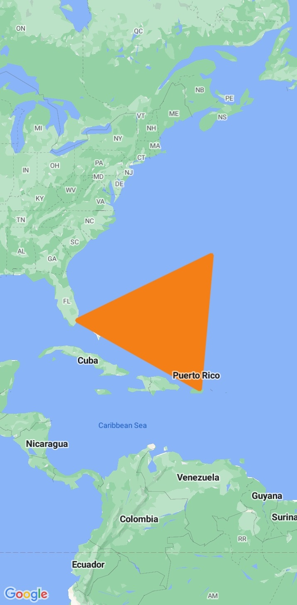

# Android - Migrating from Google Maps to Amazon Location Service

The [Amazon Location Demo](https://github.com/aws-geospatial/amazon-location-features-demo-android) open-source project can be used fully to gauge the in-depth capabilities of Amazon Location service

## Prerequisites:

1. Create an [AWS account](https://portal.aws.amazon.com/billing/signup/iam#/start/email) if you don’t already have one. Once your AWS account is set up, you can create Amazon Location Service resources, which can be utilized to run the code snippets below.
2. Choose the map style that you want to use.
    1. In the Amazon Location Service console, on the [Maps page](https://console.aws.amazon.com/location/maps/home), choose Create Map to preview map styles.
    2. Add a Name and Description for the new map resource. Make a note of the name that you use for the map resource. You will need it when creating your script file later in the tutorial.
    3. Choose a map; remember that while choosing a map style, choose which map data provider you will use. For more information, see section 82 of the [AWS service terms](http://aws.amazon.com/service-terms).
    4. Agree to the [Amazon Location Terms and Conditions](https://aws.amazon.com/service-terms/#:~:text=82.%20Amazon%20Location%20Service), then choose Create Map. You can interact with the map that you've chosen: zoom in, zoom out, or pan in any direction.
3. Choose the place index that you want to use.
    1. In the Amazon Location Service console on the [Place indexes page](https://us-east-1.console.aws.amazon.com/location/places/home?region=us-east-1), choose Create Place Index.
    2. Add a Name and Description for the new place index resource. Make a note of the name that you use for the place index resource. You will need it when creating your script file later in the tutorial.
    3. Choose a data provider; in most cases, choose the one that matches the map provider you already chose. This helps to ensure that the searches will match the maps. For more information, see section 82 of the [AWS service terms](http://aws.amazon.com/service-terms).
    4. Choose the Data storage option. The results are not stored for this tutorial so you can choose No, single use only.
    5. Agree to the [Amazon Location Terms and Conditions](https://aws.amazon.com/service-terms/#:~:text=82.%20Amazon%20Location%20Service), then choose Create Place Index.
4. Choose the route calculator that you want to use.
    1. In the Amazon Location Service console on the [Route calculators page](https://us-east-1.console.aws.amazon.com/location/routes/home?region=us-east-1#/), choose Create Route Calculator.
    2. Add a Name and Description for the new route calculator resource. Make a note of the name that you use for the route calculator resource. You will need it when creating your script file later in the tutorial.
    3. Choose a data provider; remember that while choosing a map style, also choose which map data provider you will use. For more information, see section 82 of the [AWS service terms](http://aws.amazon.com/service-terms).
    4. Agree to the [Amazon Location Terms and Conditions](https://aws.amazon.com/service-terms/#:~:text=82.%20Amazon%20Location%20Service), then choose Create Route Calculator.
5. To set up authentication for your application
    1. In Amazon Location service to authenticate your application need to set up roles in IAM roles like the below in [the AWS console](https://us-east-1.signin.aws/platform/login?workflowStateHandle=ebef097a-b05a-4111-80e9-75ee1630349f)
       1. Choose which IAM roles you want to use with your identity pool and Expand **View Details**.
       2. Under **Unauthenticated identities**, enter a role name.
       3. Expand the **View Policy Document** section, then choose **Edit** to add your policy. The edited policy will look like the one below.
       4.
        ```{
              "Version": "2012-10-17",
              "Statement": [
                {
                  "Sid": "LocationReadOnly",
                  "Effect": "Allow",
                  "Action": [
                    "geo:GetMapStyleDescriptor",
                    "geo:GetMapGlyphs",
                    "geo:GetMapSprites",
                    "geo:GetMapTile",
                    "geo:SearchPlaceIndexForPosition",
                    "geo:CalculateRoute"
                  ],
                  "Resource": [
                    "arn:aws:geo:<region>:<accountID>:map/<ExampleMap>",
                    "arn:aws:geo:<region>:<accountID>:route-calculator/<ExampleRoueCalculator>",
                    "arn:aws:geo:<region>:<accountID>:place-index/<ExamplePlaceIndex>"
                  ]
                }
              ]
            }
        ```
       5. After updating the above policy, you can access the map, route calculator and place-index.

>(Please follow this [README.md](https://github.com/aws-geospatial/amazon-location-features-demo-android/blob/main/README.md) file for more details to set up code in Android Studio.)


## **Notable differences in the Android SDKs**

* Coordinates in Google Maps are referred to as `latitude,longitude`, while Amazon Location Service uses `longitude,latitude`. The Amazon Location Service format is aligned with the standard `[x, y]`, which is followed by most Geographic Information System (GIS) platforms.
* Coordinates in Amazon Location Maps are defined as Position objects. A coordinate is specified as a number array in the format of `[longitude,latitude]`.
* Amazon Location Service has an API and SDK that work hand in hand with [MapLibre Native](https://github.com/maplibre/maplibre-native) SDK.
* The MapLibre Native SDK for Android is a library based on[Mapbox Native](https://github.com/mapbox/mapbox-gl-native), and is compatible with the styles and tiles provided by the Amazon Location Service Maps API. You can integrate MapLibre Native SDK for Android to embed interactive map views with scalable, customizable vector maps in your Android applications.

## Android SDK side-by-side examples

### Load a map

Both Google Maps and Amazon Location Service allow you to integrate interactive, customizable maps into your applications. These maps can display various types of geographical data and allow for features like panning and zooming.

#### With Google Maps

To display a map using the Google Maps SDK for Android, the following steps would be done:

**Step 1**: In Android Studio, open your app-level `build.gradle` file and update it as below.


```
plugins {
    id("com.android.application")
    id("org.jetbrains.kotlin.android")
    id("com.google.android.libraries.mapsplatform.secrets-gradle-plugin")
}

android {
    namespace = "com.example.googlemaptest"
    compileSdk = 34

    defaultConfig {
        applicationId = "com.example.googlemaptest"
        minSdk = 24
        targetSdk = 34
        versionCode = 1
        versionName = "1.0"

        testInstrumentationRunner = "androidx.test.runner.AndroidJUnitRunner"
    }

    buildTypes {
        release {
            isMinifyEnabled = false
            proguardFiles(
                getDefaultProguardFile("proguard-android-optimize.txt"),
                "proguard-rules.pro",
            )
        }
    }
    compileOptions {
        sourceCompatibility = JavaVersion.VERSION_1_8
        targetCompatibility = JavaVersion.VERSION_1_8
    }
    kotlinOptions {
        jvmTarget = "1.8"
    }
    buildFeatures {
        viewBinding = true
    }
}

dependencies {
    implementation("com.google.android.material:material:1.10.0")
    implementation("androidx.constraintlayout:constraintlayout:2.1.4")

    implementation("com.google.android.gms:play-services-maps:18.2.0")
    implementation("com.google.maps.android:android-maps-utils:3.7.0")
    implementation("com.squareup.okhttp3:okhttp:4.11.0")
}
```

**Step 2**: Save the file and [sync your project with Gradle](https://developer.android.com/studio/build#sync-files).

**Step 3**: In your `AndroidManifest.xml` file enter below code and replace `MAPS_API_KEY` with your google maps API key:

```
<meta-data
    android:name="com.google.android.geo.API_KEY"
    android:value="MAPS_API_KEY" />    
```

**Step 4**: Add the below code to `activity_maps.xml` the file

```
<?xml version="1.0" encoding="utf-8"?>
<fragment xmlns:android="http://schemas.android.com/apk/res/android"
    xmlns:map="http://schemas.android.com/apk/res-auto"
    xmlns:tools="http://schemas.android.com/tools"
    android:id="@+id/map"
    android:name="com.google.android.gms.maps.SupportMapFragment"
    android:layout_width="match_parent"
    android:layout_height="match_parent" />
```

**Step 5**: Add the below code to `MapsActivity.kt`

```
class MapsActivity : AppCompatActivity(), OnMapReadyCallback {

    private lateinit var mMap: GoogleMap
    private lateinit var binding: ActivityMapsBinding

    override fun onCreate(savedInstanceState: Bundle?) {
        super.onCreate(savedInstanceState)

        binding = ActivityMapsBinding.inflate(layoutInflater)
        setContentView(binding.root)

        val mapFragment = supportFragmentManager
            .findFragmentById(R.id.map) as SupportMapFragment
        mapFragment.getMapAsync(this)
    }

    override fun onMapReady(googleMap: GoogleMap) {
        mMap = googleMap
    }
} 
```


#### With Amazon Location

Loading a map in an Android app using Amazon Maps consists of the following steps:

**Step 1**: open your module-level `build.gradle` file and add the following `dependencies`.

```
plugins {
    id("com.android.application")
    id("org.jetbrains.kotlin.android")
}

android {
    namespace = "com.example.amazonmaptest"
    compileSdk = 34

    defaultConfig {
        applicationId = "com.example.amazonmaptest"
        minSdk = 24
        targetSdk = 34
        versionCode = 1
        versionName = "1.0"

        testInstrumentationRunner = "androidx.test.runner.AndroidJUnitRunner"
    }

    buildTypes {
        release {
            isMinifyEnabled = false
            proguardFiles(
                getDefaultProguardFile("proguard-android-optimize.txt"),
                "proguard-rules.pro",
            )
        }
    }
    compileOptions {
        sourceCompatibility = JavaVersion.VERSION_1_8
        targetCompatibility = JavaVersion.VERSION_1_8
    }
    kotlinOptions {
        jvmTarget = "1.8"
    }
    buildFeatures {
        viewBinding = true
    }
}
dependencies {
    implementation("com.google.android.material:material:1.10.0")
    implementation("androidx.constraintlayout:constraintlayout:2.1.4")

    implementation("org.maplibre.gl:android-sdk:9.6.0")
    implementation("org.maplibre.gl:android-plugin-annotation-v9:1.0.0")
    implementation("com.squareup.okhttp3:okhttp:4.11.0")
    implementation("com.amazonaws:aws-android-sdk-mobile-client:2.73.0")
}
```

**Step 2**: Create a class named `SigV4Interceptor.kt` to intercept AWS requests. This will be registered with the HTTP client used to fetch map resources when the Activity is created.

```
class SigV4Interceptor(
    private val credentialsProvider: AWSCredentialsProvider,
    private val serviceName: String,
) : Interceptor {

    override fun intercept(chain: Interceptor.Chain): Response {
        val originalRequest = chain.request()

        if (originalRequest.url.host.contains("amazonaws.com")) {
            val signer = if (originalRequest.url.encodedPath.contains("@")) {
                AWS4Signer(false)
            } else {
                AWS4Signer()
            }

            val awsRequest = toAWSRequest(originalRequest, serviceName)
            signer.setServiceName(serviceName)
            signer.sign(awsRequest, credentialsProvider.credentials)

            return chain.proceed(toSignedOkHttpRequest(awsRequest, originalRequest))
        }

        return chain.proceed(originalRequest)
    }

    companion object {
        fun toAWSRequest(request: Request, serviceName: String): DefaultRequest<Any> {
            val dr = DefaultRequest<Any>(serviceName)

            dr.httpMethod = HttpMethodName.valueOf(request.method)
            with(request.url) {
                dr.resourcePath = toUri().path
                dr.endpoint = URI.create("$scheme://$host")

                for (p in queryParameterNames) {
                    if (p != "") {
                        dr.addParameter(p, queryParameter(p))
                    }
                }
            }

            for (h in request.headers.names()) {
                dr.addHeader(h, request.header(h))
            }

            val bodyBytes = request.body?.let { body ->
                val buffer = Buffer()
                body.writeTo(buffer)
                IOUtils.toByteArray(buffer.inputStream())
            }

            dr.content = ByteArrayInputStream(bodyBytes ?: ByteArray(0))

            return dr
        }

        fun toSignedOkHttpRequest(
            awsRequest: DefaultRequest<Any>,
            originalRequest: Request,
        ): Request {
            val builder = Request.Builder()

            for ((k, v) in awsRequest.headers) {
                builder.addHeader(k, v)
            }

            val urlBuilder = HttpUrl.Builder()
                .host(awsRequest.endpoint.host)
                .scheme(awsRequest.endpoint.scheme)
                .encodedPath(awsRequest.resourcePath)

            for ((k, v) in awsRequest.parameters) {
                urlBuilder.addQueryParameter(k, v)
            }

            return builder.url(urlBuilder.build())
                .method(originalRequest.method, originalRequest.body)
                .build()
        }
    }
}
```

**Step 3**: To configure your application with your resources and AWS Region inside `configuration.xml` file like the below:

```
<?xml version="1.0" encoding="utf-8"?>
<resources>
    <string name="identityPoolId">Your Identity Pool Id</string>
    <string name="mapName">Your Map name</string>
    <string name="awsRegion">Your Region</string>
</resources>
```

**Step 4**: Add the below permission inside `AndroidManifest.xml` file:

```
<?xml version="1.0" encoding="utf-8"?>
<manifest xmlns:android="http://schemas.android.com/apk/res/android"
    xmlns:tools="http://schemas.android.com/tools">

    <uses-permission android:name="android.permission.INTERNET" />
    <uses-permission android:name="android.permission.ACCESS_NETWORK_STATE" />

    ...

</manifest>
```

**Step 5**: Add the below code inside  `activity_map_load.xml`. file

```
<?xml version="1.0" encoding="utf-8"?>
<com.mapbox.mapboxsdk.maps.MapView xmlns:android="http://schemas.android.com/apk/res/android"
    xmlns:app="http://schemas.android.com/apk/res-auto"
    android:id="@+id/mapView"
    android:layout_width="match_parent"
    android:layout_height="match_parent"
    app:mapbox_foregroundLoadColor="@color/white"
    app:mapbox_renderTextureMode="true"
    app:mapbox_renderTextureTranslucentSurface="true" />
```


**Step 6**: Add the following code to your `MapActivity.kt` file.

```
class MapActivity : AppCompatActivity(), OnMapReadyCallback {

    private lateinit var mBinding: ActivityMapLoadBinding
    override fun onCreate(savedInstanceState: Bundle?) {
        super.onCreate(savedInstanceState)
        val identityPoolId = getString(R.string.identityPoolId)

        val credentialProvider = CognitoCachingCredentialsProvider(
            applicationContext,
            identityPoolId,
            Regions.fromName(identityPoolId.split(":").first()),
        )

        Mapbox.getInstance(this@MapActivity)
        HttpRequestUtil.setOkHttpClient(
            OkHttpClient.Builder()
                .addInterceptor(SigV4Interceptor(credentialProvider, "geo"))
                .build(),
        )
        mBinding = ActivityMapLoadBinding.inflate(layoutInflater)
        setContentView(mBinding.root)
        mBinding.mapView.onCreate(savedInstanceState)
        mBinding.mapView.getMapAsync(this)
    }

    override fun onStart() {
        super.onStart()
        mBinding.mapView.onStart()
    }

    override fun onResume() {
        super.onResume()
        mBinding.mapView.onResume()
    }

    override fun onPause() {
        super.onPause()
        mBinding.mapView.onPause()
    }

    override fun onStop() {
        super.onStop()
        mBinding.mapView.onStop()
    }

    override fun onSaveInstanceState(outState: Bundle) {
        super.onSaveInstanceState(outState)
        mBinding.mapView.onSaveInstanceState(outState)
    }

    override fun onLowMemory() {
        super.onLowMemory()
        mBinding.mapView.onLowMemory()
    }

    override fun onDestroy() {
        super.onDestroy()
        mBinding.mapView.onDestroy()
    }

    override fun onMapReady(mapboxMap: MapboxMap) {
        val mapName = getString(R.string.mapName)
        val awsRegion = getString(R.string.awsRegion)
        mapboxMap.setStyle(
            Style.Builder()
                .fromUri("https://maps.geo.$awsRegion.amazonaws.com/maps/v0/maps/$mapName/style-descriptor"),
        ) { style ->
        }
    }
}
```


### How to add a marker?

Both Google Maps and Amazon Location Service can plot markers at specific coordinates on a map.

#### With Google Maps

**Step 1**: With Google Maps, markers are added using the maps `addMarker` method in `MarkerActivity.kt` .

```
class MarkerActivity : AppCompatActivity(), OnMapReadyCallback {

    private lateinit var mMap: GoogleMap
    private lateinit var binding: ActivityMapsBinding

    override fun onCreate(savedInstanceState: Bundle?) {
        super.onCreate(savedInstanceState)

        binding = ActivityMapsBinding.inflate(layoutInflater)
        setContentView(binding.root)

        val mapFragment = supportFragmentManager
            .findFragmentById(R.id.map) as SupportMapFragment
        mapFragment.getMapAsync(this)
    }

    override fun onMapReady(googleMap: GoogleMap) {
        mMap = googleMap
        val latLng = LatLng(47.6160281982247, -122.32642111977668)
        mMap.addMarker(MarkerOptions().position(latLng))
        mMap.moveCamera(CameraUpdateFactory.newLatLng(latLng))
    }
}
```


#### With Amazon Location

**Step 1**: Add the below code inside  `activity_add_marker.xml`. file

```
<?xml version="1.0" encoding="utf-8"?>
<com.mapbox.mapboxsdk.maps.MapView xmlns:android="http://schemas.android.com/apk/res/android"
    xmlns:app="http://schemas.android.com/apk/res-auto"
    android:id="@+id/mapView"
    android:layout_width="match_parent"
    android:layout_height="match_parent"
    app:mapbox_foregroundLoadColor="@color/white"
    app:mapbox_renderTextureMode="true"
    app:mapbox_renderTextureTranslucentSurface="true" />
```

**Step 2**: Add any marker drawable inside the drawable folder with the name `ic_marker_blue` , Add the code below inside `AddMarkerActivity.kt` , add [SigV4Interceptor.kt](https://makeen.quip.com/AaRHAX14ueSg/Android-Migrating-from-Google-Maps-to-Amazon-Location-Service#temp:C:XDXf5d0b216e5a8406dbc85db934) before adding the below code.

```
class AddMarkerActivity : AppCompatActivity(), OnMapReadyCallback {

    private lateinit var mBinding: ActivityAddMarkerBinding
    override fun onCreate(savedInstanceState: Bundle?) {
        super.onCreate(savedInstanceState)
        val identityPoolId = getString(R.string.identityPoolId)

        val credentialProvider = CognitoCachingCredentialsProvider(
            applicationContext,
            identityPoolId,
            Regions.fromName(identityPoolId.split(":").first()),
        )

        Mapbox.getInstance(this@AddMarkerActivity)
        HttpRequestUtil.setOkHttpClient(
            OkHttpClient.Builder()
                .addInterceptor(SigV4Interceptor(credentialProvider, "geo"))
                .build(),
        )
        mBinding = ActivityAddMarkerBinding.inflate(layoutInflater)
        setContentView(mBinding.root)
        mBinding.mapView.onCreate(savedInstanceState)
        mBinding.mapView.getMapAsync(this)
    }

    override fun onStart() {
        super.onStart()
        mBinding.mapView.onStart()
    }

    override fun onResume() {
        super.onResume()
        mBinding.mapView.onResume()
    }

    override fun onPause() {
        super.onPause()
        mBinding.mapView.onPause()
    }

    override fun onStop() {
        super.onStop()
        mBinding.mapView.onStop()
    }

    override fun onSaveInstanceState(outState: Bundle) {
        super.onSaveInstanceState(outState)
        mBinding.mapView.onSaveInstanceState(outState)
    }

    override fun onLowMemory() {
        super.onLowMemory()
        mBinding.mapView.onLowMemory()
    }

    override fun onDestroy() {
        super.onDestroy()
        mBinding.mapView.onDestroy()
    }

    override fun onMapReady(mapboxMap: MapboxMap) {
        val mapName = getString(R.string.mapName)
        val awsRegion = getString(R.string.awsRegion)
        mapboxMap.setStyle(
            Style.Builder()
                .fromUri("https://maps.geo.$awsRegion.amazonaws.com/maps/v0/maps/$mapName/style-descriptor"),
        ) { style ->
            val initialPosition = LatLng(47.6160281982247, -122.32642111977668)
            mapboxMap.cameraPosition = CameraPosition.Builder()
                .target(initialPosition)
                .zoom(13.0)
                .build()
            addMarker(mBinding.mapView, mapboxMap, this, "marker-name")
        }
    }

    private fun addMarker(
        mapView: MapView,
        mapboxMap: MapboxMap?,
        activity: Activity,
        name: String,
    ) {
        mapboxMap?.getStyle { style ->
            val symbolManager = SymbolManager(mapView, mapboxMap, style)
            ContextCompat.getDrawable(activity.baseContext, R.drawable.ic_marker_blue)?.let {
                style.addImage(
                    name,
                    it,
                )
            }
            val latLng = LatLng(47.6160281982247, -122.32642111977668)
            val symbolOptions = SymbolOptions()
                .withLatLng(latLng).withIconImage(name).withIconAnchor(Property.ICON_ANCHOR_CENTER)

            symbolManager.create(symbolOptions)
        }
    }
}
```


### Marker clustering

Both Google Maps and Amazon Location Service provide marker clustering.

#### With Google Maps

**Step 1**: Add the below line inside `dependencies` in `build.gradle` file and click on Sync now.

```
implementation("com.google.maps.android:android-maps-utils:3.7.0")
```

**Step 2**: Add the below code inside `MarkerClusterActivity.kt` .


```
class MarkerClusterActivity : AppCompatActivity(), OnMapReadyCallback {

    private lateinit var mMap: GoogleMap
    private lateinit var binding: ActivityMapsBinding
    private lateinit var clusterManager: ClusterManager<MyItem>

    override fun onCreate(savedInstanceState: Bundle?) {
        super.onCreate(savedInstanceState)

        binding = ActivityMapsBinding.inflate(layoutInflater)
        setContentView(binding.root)

        val mapFragment = supportFragmentManager
            .findFragmentById(R.id.map) as SupportMapFragment
        mapFragment.getMapAsync(this)
    }

    override fun onMapReady(googleMap: GoogleMap) {
        mMap = googleMap
        setUpClusterer()
    }

    private fun setUpClusterer() {
        mMap.moveCamera(CameraUpdateFactory.newLatLngZoom(LatLng(63.1016, -151.5129), 10f))

        clusterManager = ClusterManager(applicationContext, mMap)

        mMap.setOnCameraIdleListener(clusterManager)
        mMap.setOnMarkerClickListener(clusterManager)
        addItems()
    }

    private fun addItems() {
        clusterManager.addItem(MyItem(63.1016, -151.5129, "Title1", "Snippet1"))
        clusterManager.addItem(MyItem(63.1224, -150.4048, "Title2", "Snippet2"))
        clusterManager.addItem(MyItem(63.0781, -151.3597, "Title3", "Snippet3"))
        clusterManager.addItem(MyItem(63.0719, -151.5053, "Title4", "Snippet4"))
        clusterManager.addItem(MyItem(63.1725, -148.789, "Title5", "Snippet5"))
        clusterManager.addItem(MyItem(63.0879, -151.512, "Title6", "Snippet6"))
        clusterManager.addItem(MyItem(63.0933, -151.4378, "Title7", "Snippet7"))
        clusterManager.addItem(MyItem(63.2272, -149.6538, "Title8", "Snippet8"))
        clusterManager.addItem(MyItem(61.8518, -149.4752, "Title9", "Snippet9"))
        clusterManager.addItem(MyItem(61.6214, -150.8597, "Title10", "Snippet10"))
        clusterManager.addItem(MyItem(61.2705, -151.2484, "Title11", "Snippet11"))
        clusterManager.addItem(MyItem(65.5942, -152.0732, "Title12", "Snippet12"))
        clusterManager.addItem(MyItem(63.1812, -150.9126, "Title13", "Snippet13"))
        clusterManager.addItem(MyItem(61.5726, -147.3106, "Title14", "Snippet14"))
        clusterManager.addItem(MyItem(60.2607, -150.5846, "Title15", "Snippet15"))
        clusterManager.addItem(MyItem(63.5257, -147.8929, "Title16", "Snippet16"))
    }
    
    inner class MyItem(
        lat: Double,
        lng: Double,
        title: String,
        snippet: String,
    ) : ClusterItem {

        private val position: LatLng
        private val title: String
        private val snippet: String

        override fun getPosition(): LatLng {
            return position
        }

        override fun getTitle(): String {
            return title
        }

        override fun getSnippet(): String {
            return snippet
        }

        override fun getZIndex(): Float {
            return 0f
        }

        init {
            position = LatLng(lat, lng)
            this.title = title
            this.snippet = snippet
        }
    }
}
```

    

#### With Amazon Location

**Step 1**: Add the code below inside `activity_marker_cluster.xml` 

```
<?xml version="1.0" encoding="utf-8"?>
<com.mapbox.mapboxsdk.maps.MapView xmlns:android="http://schemas.android.com/apk/res/android"
    xmlns:app="http://schemas.android.com/apk/res-auto"
    android:id="@+id/mapView"
    android:layout_width="match_parent"
    android:layout_height="match_parent"
    app:mapbox_foregroundLoadColor="@color/white"
    app:mapbox_renderTextureMode="true"
    app:mapbox_renderTextureTranslucentSurface="true" />
```

**Step 2**: Add the code below inside `MarkerClusterActivity.kt` , add [SigV4Interceptor.kt](https://makeen.quip.com/AaRHAX14ueSg/Android-Migrating-from-Google-Maps-to-Amazon-Location-Service#temp:C:XDXf5d0b216e5a8406dbc85db934) before adding the below code.

```
class MarkerClusterActivity : AppCompatActivity(), OnMapReadyCallback {

    private lateinit var mBinding: ActivityMarkerClusterBinding
    private val CLUSTER_SOURCE_ID = "cluster-source"
    private val ICON_ID = "single-icon-id"
    private val POINT_COUNT = "point_count"
    private val geoJsonString = "{\n" +
        "  \"type\": \"FeatureCollection\",\n" +
        "  \"crs\": { \"type\": \"name\", \"properties\": { \"name\": \"urn:ogc:def:crs:OGC:1.3:CRS84\" } },\n" +
        "  \"features\": [\n" +
        "    { \"type\": \"Feature\", \"properties\": { \"id\": \"ak16994521\", \"mag\": 2.3, \"time\": 1507425650893, \"felt\": null, \"tsunami\": 0 }, \"geometry\": { \"type\": \"Point\", \"coordinates\": [ -151.5129, 63.1016, 0.0 ] } },\n" +
        "{ \"type\": \"Feature\", \"properties\": { \"id\": \"ak16994519\", \"mag\": 1.7, \"time\": 1507425289659, \"felt\": null, \"tsunami\": 0 }, \"geometry\": { \"type\": \"Point\", \"coordinates\": [ -150.4048, 63.1224, 105.5 ] } },\n" +
        "{ \"type\": \"Feature\", \"properties\": { \"id\": \"ak16994517\", \"mag\": 1.6, \"time\": 1507424832518, \"felt\": null, \"tsunami\": 0 }, \"geometry\": { \"type\": \"Point\", \"coordinates\": [ -151.3597, 63.0781, 0.0 ] } },\n" +
        "{ \"type\": \"Feature\", \"properties\": { \"id\": \"ak16994510\", \"mag\": 1.6, \"time\": 1507422449194, \"felt\": null, \"tsunami\": 0 }, \"geometry\": { \"type\": \"Point\", \"coordinates\": [ -151.5053, 63.0719, 0.0 ] } },\n" +
        "{ \"type\": \"Feature\", \"properties\": { \"id\": \"ak16994298\", \"mag\": 2.4, \"time\": 1507419370097, \"felt\": null, \"tsunami\": 0 }, \"geometry\": { \"type\": \"Point\", \"coordinates\": [ -148.789, 63.1725, 7.5 ] } },\n" +
        "{ \"type\": \"Feature\", \"properties\": { \"id\": \"ak16994293\", \"mag\": 1.5, \"time\": 1507417256497, \"felt\": null, \"tsunami\": 0 }, \"geometry\": { \"type\": \"Point\", \"coordinates\": [ -151.512, 63.0879, 10.8 ] } },\n" +
        "{ \"type\": \"Feature\", \"properties\": { \"id\": \"ak16994287\", \"mag\": 2.0, \"time\": 1507413903714, \"felt\": null, \"tsunami\": 0 }, \"geometry\": { \"type\": \"Point\", \"coordinates\": [ -151.4378, 63.0933, 0.0 ] } },\n" +
        "{ \"type\": \"Feature\", \"properties\": { \"id\": \"ak16994285\", \"mag\": 1.5, \"time\": 1507413670029, \"felt\": null, \"tsunami\": 0 }, \"geometry\": { \"type\": \"Point\", \"coordinates\": [ -149.6538, 63.2272, 96.8 ] } },\n" +
        "{ \"type\": \"Feature\", \"properties\": { \"id\": \"ak16994280\", \"mag\": 1.3, \"time\": 1507413266231, \"felt\": null, \"tsunami\": 0 }, \"geometry\": { \"type\": \"Point\", \"coordinates\": [ -149.4752, 61.8518, 54.3 ] } },\n" +
        "{ \"type\": \"Feature\", \"properties\": { \"id\": \"ak16994278\", \"mag\": 1.8, \"time\": 1507413195076, \"felt\": null, \"tsunami\": 0 }, \"geometry\": { \"type\": \"Point\", \"coordinates\": [ -150.8597, 61.6214, 50.0 ] } },\n" +
        "{ \"type\": \"Feature\", \"properties\": { \"id\": \"ak16994273\", \"mag\": 1.2, \"time\": 1507411925999, \"felt\": null, \"tsunami\": 0 }, \"geometry\": { \"type\": \"Point\", \"coordinates\": [ -151.2484, 61.2705, 69.1 ] } },\n" +
        "{ \"type\": \"Feature\", \"properties\": { \"id\": \"ak16994270\", \"mag\": 2.0, \"time\": 1507411814209, \"felt\": null, \"tsunami\": 0 }, \"geometry\": { \"type\": \"Point\", \"coordinates\": [ -152.0732, 65.5942, 14.8 ] } },\n" +
        "{ \"type\": \"Feature\", \"properties\": { \"id\": \"ak16993963\", \"mag\": 1.4, \"time\": 1507407100665, \"felt\": null, \"tsunami\": 0 }, \"geometry\": { \"type\": \"Point\", \"coordinates\": [ -150.9126, 63.1812, 150.4 ] } },\n" +
        "{ \"type\": \"Feature\", \"properties\": { \"id\": \"ak16993960\", \"mag\": 1.4, \"time\": 1507405129739, \"felt\": null, \"tsunami\": 0 }, \"geometry\": { \"type\": \"Point\", \"coordinates\": [ -147.3106, 61.5726, 26.9 ] } },\n" +
        "{ \"type\": \"Feature\", \"properties\": { \"id\": \"ak16993952\", \"mag\": 1.7, \"time\": 1507403679922, \"felt\": null, \"tsunami\": 0 }, \"geometry\": { \"type\": \"Point\", \"coordinates\": [ -150.5846, 60.2607, 34.2 ] } },\n" +
        "{ \"type\": \"Feature\", \"properties\": { \"id\": \"ak16993746\", \"mag\": 1.3, \"time\": 1507399350671, \"felt\": null, \"tsunami\": 0 }, \"geometry\": { \"type\": \"Point\", \"coordinates\": [ -147.8929, 63.5257, 3.3 ] } },\n" +
        "{ \"type\": \"Feature\", \"properties\": { \"id\": \"ak16993741\", \"mag\": 1.6, \"time\": 1507398797233, \"felt\": null, \"tsunami\": 0 }, \"geometry\": { \"type\": \"Point\", \"coordinates\": [ -151.3473, 63.0775, 0.0 ] } }\n" +
        "  ]\n" +
        "}\n"

    override fun onCreate(savedInstanceState: Bundle?) {
        super.onCreate(savedInstanceState)
        val identityPoolId = getString(R.string.identityPoolId)

        val credentialProvider = CognitoCachingCredentialsProvider(
            applicationContext,
            identityPoolId,
            Regions.fromName(identityPoolId.split(":").first()),
        )

        Mapbox.getInstance(this@MarkerClusterActivity)
        HttpRequestUtil.setOkHttpClient(
            OkHttpClient.Builder()
                .addInterceptor(SigV4Interceptor(credentialProvider, "geo"))
                .build(),
        )
        mBinding = ActivityMarkerClusterBinding.inflate(layoutInflater)
        setContentView(mBinding.root)
        mBinding.mapView.onCreate(savedInstanceState)
        mBinding.mapView.getMapAsync(this)
    }

    override fun onStart() {
        super.onStart()
        mBinding.mapView.onStart()
    }

    override fun onResume() {
        super.onResume()
        mBinding.mapView.onResume()
    }

    override fun onPause() {
        super.onPause()
        mBinding.mapView.onPause()
    }

    override fun onStop() {
        super.onStop()
        mBinding.mapView.onStop()
    }

    override fun onSaveInstanceState(outState: Bundle) {
        super.onSaveInstanceState(outState)
        mBinding.mapView.onSaveInstanceState(outState)
    }

    override fun onLowMemory() {
        super.onLowMemory()
        mBinding.mapView.onLowMemory()
    }

    override fun onDestroy() {
        super.onDestroy()
        mBinding.mapView.onDestroy()
    }

    override fun onMapReady(mapboxMap: MapboxMap) {
        val mapName = getString(R.string.mapName)
        val awsRegion = getString(R.string.awsRegion)
        mapboxMap.setStyle(
            Style.Builder()
                .fromUri("https://maps.geo.$awsRegion.amazonaws.com/maps/v0/maps/$mapName/style-descriptor"),
        ) { style ->
            val initialPosition = LatLng(63.1224, -150.4048)
            mapboxMap.cameraPosition = CameraPosition.Builder()
                .target(initialPosition)
                .zoom(7.0)
                .build()
            style.transition = TransitionOptions(0, 0, false)
            initLayerIcons(style)
            addClusteredGeoJsonSource(style)
        }
    }

    private fun initLayerIcons(loadedMapStyle: Style) {
        BitmapUtils.getBitmapFromDrawable(
            ContextCompat.getDrawable(applicationContext, R.drawable.ic_marker_blue),
        )?.let {
            loadedMapStyle.addImage(
                ICON_ID,
                it,
            )
        }
    }

    private fun addClusteredGeoJsonSource(loadedMapStyle: Style) {
        try {
            val geoJsonOptions = GeoJsonOptions().withBuffer(16)
            loadedMapStyle.addSource(
                GeoJsonSource(
                    CLUSTER_SOURCE_ID,
                    geoJsonString,
                    geoJsonOptions,
                ),
            )
        } catch (_: URISyntaxException) {
        }
        val unclusteredSymbolLayer =
            SymbolLayer("unclustered-points", CLUSTER_SOURCE_ID).withProperties(
                iconImage(ICON_ID),
                iconSize(
                    division(
                        get("mag"),
                        literal(4.0f),
                    ),
                ),
            )
        unclusteredSymbolLayer.setFilter(has("mag"))

        loadedMapStyle.addLayer(unclusteredSymbolLayer)

        loadedMapStyle.addLayer(
            SymbolLayer("count", CLUSTER_SOURCE_ID).withProperties(
                textField(Expression.toString(get(POINT_COUNT))),
                textSize(12f),
                textColor(Color.BLACK),
                textIgnorePlacement(true),
                textOffset(arrayOf(0f, .5f)),
                textAllowOverlap(true),
            ),
        )
    }
}
```

    

### Display an Info window

Both Google Maps and Amazon Location Service have the ability to render an info/popup on the map.

#### With Google Maps

**Step 1**: Add the code below inside `InfoWindowActivity.kt`

```
class InfoWindowActivity : AppCompatActivity(), OnMapReadyCallback {

    private lateinit var mMap: GoogleMap
    private lateinit var binding: ActivityMapsBinding

    override fun onCreate(savedInstanceState: Bundle?) {
        super.onCreate(savedInstanceState)

        binding = ActivityMapsBinding.inflate(layoutInflater)
        setContentView(binding.root)

        val mapFragment = supportFragmentManager
            .findFragmentById(R.id.map) as SupportMapFragment
        mapFragment.getMapAsync(this)
    }

    override fun onMapReady(googleMap: GoogleMap) {
        mMap = googleMap
        val latLng = LatLng(47.6160281982247, -122.32642111977668)
        mMap.addMarker(
            MarkerOptions().position(latLng).title("Test")
                .snippet("Population: 4,137,400"),
        )
        mMap.moveCamera(CameraUpdateFactory.newLatLng(latLng))
    }
}
```


#### With Amazon Location

**Step 1**: Add the below code inside  `activity_map_load.xml`. file

```
<?xml version="1.0" encoding="utf-8"?>
<com.mapbox.mapboxsdk.maps.MapView xmlns:android="http://schemas.android.com/apk/res/android"
    xmlns:app="http://schemas.android.com/apk/res-auto"
    android:id="@+id/mapView"
    android:layout_width="match_parent"
    android:layout_height="match_parent"
    app:mapbox_foregroundLoadColor="@color/white"
    app:mapbox_renderTextureMode="true"
    app:mapbox_renderTextureTranslucentSurface="true" />.
```

**Step 2**: Add the code below inside `InfoWindowActivity.kt` , add [SigV4Interceptor.kt](https://makeen.quip.com/AaRHAX14ueSg/Android-Migrating-from-Google-Maps-to-Amazon-Location-Service#temp:C:XDXf5d0b216e5a8406dbc85db934) before adding the below code.

```
class InfoWindowActivity : AppCompatActivity(), OnMapReadyCallback, MapboxMap.OnMapClickListener {
    
    private lateinit var mBinding: ActivityMapLoadBinding
    private val GEOJSON_SOURCE_ID = "GEOJSON_SOURCE_ID"
    private val MARKER_IMAGE_ID = "MARKER_IMAGE_ID"
    private val MARKER_LAYER_ID = "MARKER_LAYER_ID"
    private val CALLOUT_LAYER_ID = "CALLOUT_LAYER_ID"
    private val PROPERTY_SELECTED = "selected"
    private val PROPERTY_NAME = "name"
    private val PROPERTY_CAPITAL = "capital"
    private var source: GeoJsonSource? = null
    private var featureCollection: FeatureCollection? = null
    private var map: MapboxMap? = null
    
    override fun onCreate(savedInstanceState: Bundle?) {
        super.onCreate(savedInstanceState)
        val identityPoolId = getString(R.string.identityPoolId)

        val credentialProvider = CognitoCachingCredentialsProvider(
            applicationContext,
            identityPoolId,
            Regions.fromName(identityPoolId.split(":").first()),
        )

        Mapbox.getInstance(this@InfoWindowActivity)
        HttpRequestUtil.setOkHttpClient(
            OkHttpClient.Builder()
                .addInterceptor(SigV4Interceptor(credentialProvider, "geo"))
                .build(),
        )
        mBinding = ActivityMapLoadBinding.inflate(layoutInflater)
        setContentView(mBinding.root)
        mBinding.mapView.onCreate(savedInstanceState)
        mBinding.mapView.getMapAsync(this)
    }

    override fun onStart() {
        super.onStart()
        mBinding.mapView.onStart()
    }

    override fun onResume() {
        super.onResume()
        mBinding.mapView.onResume()
    }

    override fun onPause() {
        super.onPause()
        mBinding.mapView.onPause()
    }

    override fun onStop() {
        super.onStop()
        mBinding.mapView.onStop()
    }

    override fun onSaveInstanceState(outState: Bundle) {
        super.onSaveInstanceState(outState)
        mBinding.mapView.onSaveInstanceState(outState)
    }

    override fun onLowMemory() {
        super.onLowMemory()
        mBinding.mapView.onLowMemory()
    }

    override fun onDestroy() {
        super.onDestroy()
        mBinding.mapView.onDestroy()
    }

    override fun onMapReady(mapboxMap: MapboxMap) {
        val mapName = getString(R.string.mapName)
        val awsRegion = getString(R.string.awsRegion)
        mapboxMap.setStyle(
            Style.Builder()
                .fromUri("https://maps.geo.$awsRegion.amazonaws.com/maps/v0/maps/$mapName/style-descriptor"),
        ) {
            map = mapboxMap
            val initialPosition = LatLng(47.6160281982247, -122.32642111977668)
            mapboxMap.*cameraPosition* = CameraPosition.Builder()
                .target(initialPosition)
                .zoom(13.0)
                .build()
            val featureCollection = FeatureCollection.fromJson(
                "{\n" +
                    "  \"type\": \"FeatureCollection\",\n" +
                    "  \"features\": [\n" +
                    "    {\n" +
                    "      \"type\": \"Feature\",\n" +
                    "      \"properties\": {\n" +
                    "        \"marker-color\": \"#7e7e7e\",\n" +
                    "        \"marker-size\": \"medium\",\n" +
                    "        \"marker-symbol\": \"\",\n" +
                    "        \"name\": \"Washington\",\n" +
                    "        \"capital\": \"Olympia\"\n" +
                    "      },\n" +
                    "      \"geometry\": {\n" +
                    "        \"type\": \"Point\",\n" +
                    "        \"coordinates\": [\n" +
                    "          -122.90480,\n" +
                    "          47.03676\n" +
                    "        ]\n" +
                    "      }\n" +
                    "    }\n" +
                    "  ]\n" +
                    "}",
            )
            for (singleFeature in featureCollection.features()!!) {
                singleFeature.addBooleanProperty("selected", false)
            }
            setUpData(featureCollection)

            val viewMap = HashMap<String, View>()
            val imagesMap = HashMap<String, Bitmap>()
            val inflater = LayoutInflater.from(this)
            if (featureCollection != null) {
                for (feature in featureCollection.features()!!) {
                    val layout = inflater.inflate(
                        R.layout.symbol_layer_info_window_layout_callout,
                        null,
                    ) as LinearLayout
                    val name = feature.getStringProperty(PROPERTY_NAME)
                    val titleTextView =
                        layout.findViewById<TextView>(R.id.info_window_title)
                    titleTextView.text = name
                    val style = feature.getStringProperty(PROPERTY_CAPITAL)
                    val descriptionTextView =
                        layout.findViewById<TextView>(R.id.info_window_description)
                    descriptionTextView.text = java.lang.String.format(
                        getString(R.string.capital),
                        style,
                    )
                    val measureSpec =
                        View.MeasureSpec.makeMeasureSpec(0, View.MeasureSpec.UNSPECIFIED)
                    layout.measure(measureSpec, measureSpec)
                    val bitmap: Bitmap = SymbolGenerator.generate(layout)
                    imagesMap[name] = bitmap
                    viewMap[name] = layout
                }
            }

            setImageGenResults(imagesMap)
            refreshSource()
            mapboxMap.addOnMapClickListener(this@InfoWindowActivity)
        }
    }

    private fun setUpData(collection: FeatureCollection) {
        featureCollection = collection
        map?.getStyle { style ->
            setupSource(style)
            setUpImage(style)
            setUpMarkerLayer(style)
            setUpInfoWindowLayer(style)
        }
    }

    private fun setupSource(loadedStyle: Style) {
        source = GeoJsonSource(GEOJSON_SOURCE_ID, featureCollection)
        loadedStyle.addSource(source!!)
    }

    private fun setUpImage(loadedStyle: Style) {
        ContextCompat.getDrawable(applicationContext, R.drawable.ic_marker_red)?.let {
            loadedStyle.addImage(
                MARKER_IMAGE_ID,
                it,
            )
        }
    }

    private fun refreshSource() {
        if (source != null && featureCollection != null) {
            source!!.setGeoJson(featureCollection)
        }
    }

    private fun setUpMarkerLayer(loadedStyle: Style) {
        loadedStyle.addLayer(
            SymbolLayer(MARKER_LAYER_ID, GEOJSON_SOURCE_ID)
                .withProperties(
                    iconImage(MARKER_IMAGE_ID),
                    iconAllowOverlap(true),
                    iconOffset(arrayOf(0f, -8f)),
                ),
        )
    }

    private fun setUpInfoWindowLayer(loadedStyle: Style) {
        loadedStyle.addLayer(
            SymbolLayer(CALLOUT_LAYER_ID, GEOJSON_SOURCE_ID)
                .withProperties(
                    iconImage("{name}"),
                    iconAnchor(ICON_ANCHOR_BOTTOM),
                    iconAllowOverlap(true),
                    iconOffset(arrayOf(-2f, -28f)),
                )
                .withFilter(eq(get(PROPERTY_SELECTED), literal(true))),
        )
    }

    private fun handleClickIcon(screenPoint: PointF): Boolean {
        val features: List<Feature> =
            map!!.queryRenderedFeatures(screenPoint, MARKER_LAYER_ID)
        return if (features.isNotEmpty()) {
            val name: String = features[0].getStringProperty(PROPERTY_NAME)
            val featureList: List<Feature>? = featureCollection!!.features()
            if (featureList != null) {
                for (i in featureList.indices) {
                    if (featureList[i].getStringProperty(PROPERTY_NAME).equals(name)) {
                        if (featureSelectStatus(i)) {
                            setFeatureSelectState(featureList[i], false)
                        } else {
                            setSelected(i)
                        }
                    }
                }
            }
            true
        } else {
            false
        }
    }

    private fun setSelected(index: Int) {
        if (featureCollection!!.features() != null) {
            val feature = featureCollection!!.features()!![index]
            setFeatureSelectState(feature, true)
            refreshSource()
        }
    }

    private fun setFeatureSelectState(feature: Feature, selectedState: Boolean) {
        if (feature.properties() != null) {
            feature.properties()!!.addProperty(PROPERTY_SELECTED, selectedState)
            refreshSource()
        }
    }

    private fun featureSelectStatus(index: Int): Boolean {
        return if (featureCollection == null) {
            false
        } else {
            featureCollection!!.features()!![index].getBooleanProperty(PROPERTY_SELECTED)
        }
    }

    private fun setImageGenResults(imageMap: HashMap<String, Bitmap>?) {
        if (map != null) {
            map!!.getStyle { style ->
                if (imageMap != null) {
                    style.addImages(imageMap)
                }
            }
        }
    }

    private object SymbolGenerator {
        fun generate(view: View): Bitmap {
            val measureSpec = View.MeasureSpec.makeMeasureSpec(0, View.MeasureSpec.UNSPECIFIED)
            view.measure(measureSpec, measureSpec)
            val measuredWidth = view.measuredWidth
            val measuredHeight = view.measuredHeight
            view.layout(0, 0, measuredWidth, measuredHeight)
            val bitmap = Bitmap.createBitmap(measuredWidth, measuredHeight, Bitmap.Config.ARGB_8888)
            bitmap.eraseColor(Color.TRANSPARENT)
            val canvas = Canvas(bitmap)
            view.draw(canvas)
            return bitmap
        }
    }

    override fun onMapClick(point: LatLng): Boolean {
        return handleClickIcon(map!!.projection.toScreenLocation(point))
    }
}
```


### How to add a polyline?

Polylines can be drawn on Google Maps. For Amazon Location Service, there isn't any built-in support for polylines.

#### With Google Maps

**Step 1**: Add the code below inside `PolylineActivity.kt`

```
class PolylineActivity : AppCompatActivity(), OnMapReadyCallback {

    private lateinit var mMap: GoogleMap
    private lateinit var binding: ActivityMapsBinding

    override fun onCreate(savedInstanceState: Bundle?) {
        super.onCreate(savedInstanceState)

        binding = ActivityMapsBinding.inflate(layoutInflater)
        setContentView(binding.root)

        val mapFragment = supportFragmentManager
            .findFragmentById(R.id.map) as SupportMapFragment
        mapFragment.getMapAsync(this)
    }

    override fun onMapReady(googleMap: GoogleMap) {
        mMap = googleMap
        mMap.addPolyline(
            PolylineOptions()
                .add(
                    LatLng(47.6160281982247, -122.32642111977668),
                    LatLng(47.603565, -121.774015),
                    LatLng(47.328766, -121.828946),
                    LatLng(47.252465, -122.286552),
                    LatLng(47.6160281982247, -122.32642111977668),
                ),
        )
        mMap.animateCamera(
            CameraUpdateFactory.newLatLngZoom(
                LatLng(
                    47.6160281982247,
                    -122.32642111977668,
                ),
                8.0f,
            ),
        )
    }
}
```


#### With Amazon Location

**Step 1**: Add the below code inside `activity_polyline.xml`

```
<?xml version="1.0" encoding="utf-8"?>
<com.mapbox.mapboxsdk.maps.MapView xmlns:android="http://schemas.android.com/apk/res/android"
    xmlns:app="http://schemas.android.com/apk/res-auto"
    android:id="@+id/mapView"
    android:layout_width="match_parent"
    android:layout_height="match_parent"
    app:mapbox_foregroundLoadColor="@color/white"
    app:mapbox_renderTextureMode="true"
    app:mapbox_renderTextureTranslucentSurface="true" />
```

**Step 2**: Add the below code inside `PolylineActivity.kt` , add [SigV4Interceptor.kt](https://makeen.quip.com/AaRHAX14ueSg/Android-Migrating-from-Google-Maps-to-Amazon-Location-Service#temp:C:XDXf5d0b216e5a8406dbc85db934) before adding the below code.

```
class PolylineActivity : AppCompatActivity(), OnMapReadyCallback {

    private lateinit var mBinding: ActivityPolylineBinding
    
    override fun onCreate(savedInstanceState: Bundle?) {
        super.onCreate(savedInstanceState)
        val identityPoolId = getString(R.string.identityPoolId)

        val credentialProvider = CognitoCachingCredentialsProvider(
            applicationContext,
            identityPoolId,
            Regions.fromName(identityPoolId.split(":").first()),
        )

        Mapbox.getInstance(this@PolylineActivity)
        HttpRequestUtil.setOkHttpClient(
            OkHttpClient.Builder()
                .addInterceptor(SigV4Interceptor(credentialProvider, "geo"))
                .build(),
        )
        mBinding = ActivityPolylineBinding.inflate(layoutInflater)
        setContentView(mBinding.root)
        mBinding.mapView.onCreate(savedInstanceState)
        mBinding.mapView.getMapAsync(this)
    }

    override fun onStart() {
        super.onStart()
        mBinding.mapView.onStart()
    }

    override fun onResume() {
        super.onResume()
        mBinding.mapView.onResume()
    }

    override fun onPause() {
        super.onPause()
        mBinding.mapView.onPause()
    }

    override fun onStop() {
        super.onStop()
        mBinding.mapView.onStop()
    }

    override fun onSaveInstanceState(outState: Bundle) {
        super.onSaveInstanceState(outState)
        mBinding.mapView.onSaveInstanceState(outState)
    }

    override fun onLowMemory() {
        super.onLowMemory()
        mBinding.mapView.onLowMemory()
    }

    override fun onDestroy() {
        super.onDestroy()
        mBinding.mapView.onDestroy()
    }

    override fun onMapReady(mapboxMap: MapboxMap) {
        val mapName = getString(R.string.mapName)
        val awsRegion = getString(R.string.awsRegion)
        mapboxMap.setStyle(
            Style.Builder()
                .fromUri("https://maps.geo.$awsRegion.amazonaws.com/maps/v0/maps/$mapName/style-descriptor"),
        ) { style ->
            val initialPosition = LatLng(47.6160281982247, -122.32642111977668)
            mapboxMap.cameraPosition = CameraPosition.Builder()
                .target(initialPosition)
                .zoom(7.0)
                .build()
            addLine(
                style,
                listOf(
                    Point.fromLngLat(-122.32642111977668, 47.6160281982247),
                    Point.fromLngLat(-121.774015, 47.603565),
                    Point.fromLngLat(-121.828946, 47.328766),
                    Point.fromLngLat(-122.286552, 47.252465),
                    Point.fromLngLat(-122.32642111977668, 47.6160281982247),
                ),
            )
        }
    }
    private fun addLine(
        style: Style,
        coordinates: List<Point>,
    ) {
        val mSourceId = "line-source"
        style.removeSource(mSourceId)
        val mLayerId = UUID.randomUUID().toString()
        val lineString: LineString = LineString.fromLngLats(coordinates)
        val feature: Feature = Feature.fromGeometry(lineString)

        val featureCollection = FeatureCollection.fromFeature(feature)
        val geoJsonSource = GeoJsonSource(mSourceId, featureCollection)
        style.addSource(geoJsonSource)

        style.addLayer(
            LineLayer(mLayerId, mSourceId).withProperties(
                PropertyFactory.lineDasharray(arrayOf()),
                PropertyFactory.lineWidth(6f),
                PropertyFactory.lineColor("#111"),
            ),
        )
    }
}
```


### How to add a polygon?

Polygons are used to represent an area on the map. The following examples show you how to create a polygon.

#### With Google Maps

**Step 1**: Add the code below inside `PolygonActivity.kt`

```
class PolygonActivity : AppCompatActivity(), OnMapReadyCallback {

    private lateinit var mMap: GoogleMap
    private lateinit var binding: ActivityMapsBinding

    override fun onCreate(savedInstanceState: Bundle?) {
        super.onCreate(savedInstanceState)

        binding = ActivityMapsBinding.inflate(layoutInflater)
        setContentView(binding.root)

        val mapFragment = supportFragmentManager
            .findFragmentById(R.id.map) as SupportMapFragment
        mapFragment.getMapAsync(this)
    }

    override fun onMapReady(googleMap: GoogleMap) {
        mMap = googleMap
        val polygon = mMap.addPolygon(
            PolygonOptions()
                .add(
                    LatLng(47.6160281982247, -122.32642111977668),
                    LatLng(47.603565, -121.774015),
                    LatLng(47.328766, -121.828946),
                    LatLng(47.252465, -122.286552),
                    LatLng(47.6160281982247, -122.32642111977668),
                ),
        )
        polygon.fillColor = -0xa80e9
        polygon.strokeColor = -0xa80e9
        mMap.animateCamera(
            CameraUpdateFactory.newLatLngZoom(
                LatLng(
                    47.6160281982247,
                    -122.32642111977668,
                ),
                8.0f,
            ),
        )
    }
}
```



#### With Amazon Location

**Step 1**: Add the code below inside `activity_polygon.xml`

```
<?xml version="1.0" encoding="utf-8"?>
<com.mapbox.mapboxsdk.maps.MapView xmlns:android="http://schemas.android.com/apk/res/android"
    xmlns:app="http://schemas.android.com/apk/res-auto"
    android:id="@+id/mapView"
    android:layout_width="match_parent"
    android:layout_height="match_parent"
    app:mapbox_foregroundLoadColor="@color/white"
    app:mapbox_renderTextureMode="true"
    app:mapbox_renderTextureTranslucentSurface="true" />
```

**Step 2**: Add the code below inside `PolygonActivity.kt` , add [SigV4Interceptor.kt](https://makeen.quip.com/AaRHAX14ueSg/Android-Migrating-from-Google-Maps-to-Amazon-Location-Service#temp:C:XDXf5d0b216e5a8406dbc85db934) before adding the below code.

```
class PolygonActivity : AppCompatActivity(), OnMapReadyCallback {

    private lateinit var mBinding: ActivityPolygonBinding
    
    override fun onCreate(savedInstanceState: Bundle?) {
        super.onCreate(savedInstanceState)
        val identityPoolId = getString(R.string.identityPoolId)

        val credentialProvider = CognitoCachingCredentialsProvider(
            applicationContext,
            identityPoolId,
            Regions.fromName(identityPoolId.split(":").first()),
        )

        Mapbox.getInstance(this@PolygonActivity)
        HttpRequestUtil.setOkHttpClient(
            OkHttpClient.Builder()
                .addInterceptor(SigV4Interceptor(credentialProvider, "geo"))
                .build(),
        )
        mBinding = ActivityPolygonBinding.inflate(layoutInflater)
        setContentView(mBinding.root)
        mBinding.mapView.onCreate(savedInstanceState)
        mBinding.mapView.getMapAsync(this)
    }

    override fun onStart() {
        super.onStart()
        mBinding.mapView.onStart()
    }

    override fun onResume() {
        super.onResume()
        mBinding.mapView.onResume()
    }

    override fun onPause() {
        super.onPause()
        mBinding.mapView.onPause()
    }

    override fun onStop() {
        super.onStop()
        mBinding.mapView.onStop()
    }

    override fun onSaveInstanceState(outState: Bundle) {
        super.onSaveInstanceState(outState)
        mBinding.mapView.onSaveInstanceState(outState)
    }

    override fun onLowMemory() {
        super.onLowMemory()
        mBinding.mapView.onLowMemory()
    }

    override fun onDestroy() {
        super.onDestroy()
        mBinding.mapView.onDestroy()
    }

    override fun onMapReady(mapboxMap: MapboxMap) {
        val mapName = getString(R.string.mapName)
        val awsRegion = getString(R.string.awsRegion)
        mapboxMap.setStyle(
            Style.Builder()
                .fromUri("https://maps.geo.$awsRegion.amazonaws.com/maps/v0/maps/$mapName/style-descriptor"),
        ) { style ->
            val initialPosition = LatLng(47.6160281982247, -122.32642111977668)
            mapboxMap.cameraPosition = CameraPosition.Builder()
                .target(initialPosition)
                .zoom(7.0)
                .build()
            addPolygon(style)
        }
    }

    private fun addPolygon(style: Style) {
        val polygonCoordinates = mutableListOf<List<Point>>()
        polygonCoordinates.add(
            listOf(
                Point.fromLngLat(-122.32642111977668, 47.6160281982247),
                Point.fromLngLat(-121.774015, 47.603565),
                Point.fromLngLat(-121.828946, 47.328766),
                Point.fromLngLat(-122.286552, 47.252465),
                Point.fromLngLat(-122.32642111977668, 47.6160281982247),
            ),
        )

        val polygon = Polygon.fromLngLats(polygonCoordinates)
        val polygonFeature = Feature.fromGeometry(polygon)

        val geoJsonSource = GeoJsonSource("polygon-source", polygonFeature)
        style.addSource(geoJsonSource)

        style.addLayer(
            FillLayer("polygon-layer", "polygon-source")
                .withProperties(
                    PropertyFactory.fillColor(-0xa80e9),
                    PropertyFactory.fillOpacity(1f),
                ),
        )
    }
}
```


### Add a heat map (Data Layers)

Google Maps supports data layer functionality, allowing you to overlay data on the map. This feature is not available natively with Amazon Location service.

#### With Google Maps

**Step 1**: Add the below line inside `dependencies` in `build.gradle` file

```
implementation("com.google.maps.android:android-maps-utils:3.7.0")
```

**Step 2**: With Google Maps, heat map are added using the maps `addHeatMap` method in `HeatMapActivity.kt` .

```
class HeatMapActivity : AppCompatActivity(), OnMapReadyCallback {

    private lateinit var mMap: GoogleMap
    private lateinit var binding: ActivityMapsBinding

    override fun onCreate(savedInstanceState: Bundle?) {
        super.onCreate(savedInstanceState)

        binding = ActivityMapsBinding.inflate(layoutInflater)
        setContentView(binding.root)

        val mapFragment = supportFragmentManager
            .findFragmentById(R.id.map) as SupportMapFragment
        mapFragment.getMapAsync(this)
    }

    override fun onMapReady(googleMap: GoogleMap) {
        mMap = googleMap
        addHeatMap()
    }

    private fun addHeatMap() {
        val latLng = arrayListOf<LatLng>()
        latLng.add(LatLng(63.1016, -151.5129))
        latLng.add(LatLng(63.1224, -150.4048))
        latLng.add(LatLng(63.0781, -151.3597))
        latLng.add(LatLng(63.0719, -151.5053))
        latLng.add(LatLng(63.1725, -148.789))
        latLng.add(LatLng(63.0879, -151.512))
        latLng.add(LatLng(63.0933, -151.4378))
        latLng.add(LatLng(63.2272, -149.6538))
        latLng.add(LatLng(61.8518, -149.4752))
        latLng.add(LatLng(61.6214, -150.8597))
        latLng.add(LatLng(61.2705, -151.2484))
        latLng.add(LatLng(65.5942, -152.0732))
        latLng.add(LatLng(63.1812, -150.9126))
        latLng.add(LatLng(61.5726, -147.3106))
        latLng.add(LatLng(60.2607, -150.5846))
        latLng.add(LatLng(63.5257, -147.8929))
        val provider = HeatmapTileProvider.Builder()
            .data(latLng)
            .build()

        mMap.addTileOverlay(TileOverlayOptions().tileProvider(provider))
        mMap.animateCamera(
            CameraUpdateFactory.newLatLngZoom(
                LatLng(
                    63.1016,
                    -151.5129,
                ),
                8.0f,
            ),
        )
    }
}
```


#### With Amazon Location

**Step 1**: Add the below code inside  `activity_map_load.xml`. file

```
<?xml version="1.0" encoding="utf-8"?>
<com.mapbox.mapboxsdk.maps.MapView xmlns:android="http://schemas.android.com/apk/res/android"
    xmlns:app="http://schemas.android.com/apk/res-auto"
    android:id="@+id/mapView"
    android:layout_width="match_parent"
    android:layout_height="match_parent"
    app:mapbox_foregroundLoadColor="@color/white"
    app:mapbox_renderTextureMode="true"
    app:mapbox_renderTextureTranslucentSurface="true" />
```

**Step 2**: Add the below code inside `HeatMapActivity.kt` , add [SigV4Interceptor.kt](https://makeen.quip.com/AaRHAX14ueSg/Android-Migrating-from-Google-Maps-to-Amazon-Location-Service#temp:C:XDXf5d0b216e5a8406dbc85db934) before adding the below code.

```
class HeatMapActivity : AppCompatActivity(), OnMapReadyCallback {

    private lateinit var mBinding: ActivityMapLoadBinding
    private val CLUSTER_SOURCE_ID = "cluster-source"
    private val ICON_ID = "single-icon-id"
    private val HEATMAP_LAYER_SOURCE = "heatmap_layer_source"
    private val CIRCLE_LAYER_ID = "circle_layer_id"
    private val geoJsonString = "{\n" +
        "  \"type\": \"FeatureCollection\",\n" +
        "  \"crs\": { \"type\": \"name\", \"properties\": { \"name\": \"urn:ogc:def:crs:OGC:1.3:CRS84\" } },\n" +
        "  \"features\": [\n" +
        "    { \"type\": \"Feature\", \"properties\": { \"id\": \"ak16994521\", \"mag\": 2.3, \"time\": 1507425650893, \"felt\": null, \"tsunami\": 0 }, \"geometry\": { \"type\": \"Point\", \"coordinates\": [ -151.5129, 63.1016, 0.0 ] } },\n" +
        "{ \"type\": \"Feature\", \"properties\": { \"id\": \"ak16994519\", \"mag\": 1.7, \"time\": 1507425289659, \"felt\": null, \"tsunami\": 0 }, \"geometry\": { \"type\": \"Point\", \"coordinates\": [ -150.4048, 63.1224, 105.5 ] } },\n" +
        "{ \"type\": \"Feature\", \"properties\": { \"id\": \"ak16994517\", \"mag\": 1.6, \"time\": 1507424832518, \"felt\": null, \"tsunami\": 0 }, \"geometry\": { \"type\": \"Point\", \"coordinates\": [ -151.3597, 63.0781, 0.0 ] } },\n" +
        "{ \"type\": \"Feature\", \"properties\": { \"id\": \"ak16994510\", \"mag\": 1.6, \"time\": 1507422449194, \"felt\": null, \"tsunami\": 0 }, \"geometry\": { \"type\": \"Point\", \"coordinates\": [ -151.5053, 63.0719, 0.0 ] } },\n" +
        "{ \"type\": \"Feature\", \"properties\": { \"id\": \"ak16994298\", \"mag\": 2.4, \"time\": 1507419370097, \"felt\": null, \"tsunami\": 0 }, \"geometry\": { \"type\": \"Point\", \"coordinates\": [ -148.789, 63.1725, 7.5 ] } },\n" +
        "{ \"type\": \"Feature\", \"properties\": { \"id\": \"ak16994293\", \"mag\": 1.5, \"time\": 1507417256497, \"felt\": null, \"tsunami\": 0 }, \"geometry\": { \"type\": \"Point\", \"coordinates\": [ -151.512, 63.0879, 10.8 ] } },\n" +
        "{ \"type\": \"Feature\", \"properties\": { \"id\": \"ak16994287\", \"mag\": 2.0, \"time\": 1507413903714, \"felt\": null, \"tsunami\": 0 }, \"geometry\": { \"type\": \"Point\", \"coordinates\": [ -151.4378, 63.0933, 0.0 ] } },\n" +
        "{ \"type\": \"Feature\", \"properties\": { \"id\": \"ak16994285\", \"mag\": 1.5, \"time\": 1507413670029, \"felt\": null, \"tsunami\": 0 }, \"geometry\": { \"type\": \"Point\", \"coordinates\": [ -149.6538, 63.2272, 96.8 ] } },\n" +
        "{ \"type\": \"Feature\", \"properties\": { \"id\": \"ak16994280\", \"mag\": 1.3, \"time\": 1507413266231, \"felt\": null, \"tsunami\": 0 }, \"geometry\": { \"type\": \"Point\", \"coordinates\": [ -149.4752, 61.8518, 54.3 ] } },\n" +
        "{ \"type\": \"Feature\", \"properties\": { \"id\": \"ak16994278\", \"mag\": 1.8, \"time\": 1507413195076, \"felt\": null, \"tsunami\": 0 }, \"geometry\": { \"type\": \"Point\", \"coordinates\": [ -150.8597, 61.6214, 50.0 ] } },\n" +
        "{ \"type\": \"Feature\", \"properties\": { \"id\": \"ak16994273\", \"mag\": 1.2, \"time\": 1507411925999, \"felt\": null, \"tsunami\": 0 }, \"geometry\": { \"type\": \"Point\", \"coordinates\": [ -151.2484, 61.2705, 69.1 ] } },\n" +
        "{ \"type\": \"Feature\", \"properties\": { \"id\": \"ak16994270\", \"mag\": 2.0, \"time\": 1507411814209, \"felt\": null, \"tsunami\": 0 }, \"geometry\": { \"type\": \"Point\", \"coordinates\": [ -152.0732, 65.5942, 14.8 ] } },\n" +
        "{ \"type\": \"Feature\", \"properties\": { \"id\": \"ak16993963\", \"mag\": 1.4, \"time\": 1507407100665, \"felt\": null, \"tsunami\": 0 }, \"geometry\": { \"type\": \"Point\", \"coordinates\": [ -150.9126, 63.1812, 150.4 ] } },\n" +
        "{ \"type\": \"Feature\", \"properties\": { \"id\": \"ak16993960\", \"mag\": 1.4, \"time\": 1507405129739, \"felt\": null, \"tsunami\": 0 }, \"geometry\": { \"type\": \"Point\", \"coordinates\": [ -147.3106, 61.5726, 26.9 ] } },\n" +
        "{ \"type\": \"Feature\", \"properties\": { \"id\": \"ak16993952\", \"mag\": 1.7, \"time\": 1507403679922, \"felt\": null, \"tsunami\": 0 }, \"geometry\": { \"type\": \"Point\", \"coordinates\": [ -150.5846, 60.2607, 34.2 ] } },\n" +
        "{ \"type\": \"Feature\", \"properties\": { \"id\": \"ak16993746\", \"mag\": 1.3, \"time\": 1507399350671, \"felt\": null, \"tsunami\": 0 }, \"geometry\": { \"type\": \"Point\", \"coordinates\": [ -147.8929, 63.5257, 3.3 ] } },\n" +
        "{ \"type\": \"Feature\", \"properties\": { \"id\": \"ak16993741\", \"mag\": 1.6, \"time\": 1507398797233, \"felt\": null, \"tsunami\": 0 }, \"geometry\": { \"type\": \"Point\", \"coordinates\": [ -151.3473, 63.0775, 0.0 ] } }\n" +
        "  ]\n" +
        "}\n"

    override fun onCreate(savedInstanceState: Bundle?) {
        super.onCreate(savedInstanceState)
        val identityPoolId = getString(R.string.identityPoolId)

        val credentialProvider = CognitoCachingCredentialsProvider(
            applicationContext,
            identityPoolId,
            Regions.fromName(identityPoolId.split(":").first()),
        )

        Mapbox.getInstance(this@HeatMapActivity)
        HttpRequestUtil.setOkHttpClient(
            OkHttpClient.Builder()
                .addInterceptor(SigV4Interceptor(credentialProvider, "geo"))
                .build(),
        )
        mBinding = ActivityMapLoadBinding.inflate(layoutInflater)
        setContentView(mBinding.root)
        mBinding.mapView.onCreate(savedInstanceState)
        mBinding.mapView.getMapAsync(this)
    }

    override fun onStart() {
        super.onStart()
        mBinding.mapView.onStart()
    }

    override fun onResume() {
        super.onResume()
        mBinding.mapView.onResume()
    }

    override fun onPause() {
        super.onPause()
        mBinding.mapView.onPause()
    }

    override fun onStop() {
        super.onStop()
        mBinding.mapView.onStop()
    }

    override fun onSaveInstanceState(outState: Bundle) {
        super.onSaveInstanceState(outState)
        mBinding.mapView.onSaveInstanceState(outState)
    }

    override fun onLowMemory() {
        super.onLowMemory()
        mBinding.mapView.onLowMemory()
    }

    override fun onDestroy() {
        super.onDestroy()
        mBinding.mapView.onDestroy()
    }

    override fun onMapReady(mapboxMap: MapboxMap) {
        val mapName = getString(R.string.mapName)
        val awsRegion = getString(R.string.awsRegion)
        mapboxMap.setStyle(
            Style.Builder()
                .fromUri("https://maps.geo.$awsRegion.amazonaws.com/maps/v0/maps/$mapName/style-descriptor"),
        ) { style ->
            val initialPosition = LatLng(63.1224, -150.4048)
            mapboxMap.cameraPosition = CameraPosition.Builder()
                .target(initialPosition)
                .zoom(4.0)
                .build()
            addSource(style)
            addHeatmapLayer(style)
            addCircleLayer(style)
        }
    }

    private fun addSource(loadedMapStyle: Style) {
        try {
            val geoJsonOptions = GeoJsonOptions().withBuffer(16)
            loadedMapStyle.addSource(
                GeoJsonSource(
                    CLUSTER_SOURCE_ID,
                    geoJsonString,
                    geoJsonOptions,
                ),
            )
        } catch (_: URISyntaxException) {
        }
    }

    private fun addHeatmapLayer(loadedMapStyle: Style) {
        val layer = HeatmapLayer(ICON_ID, CLUSTER_SOURCE_ID)
        layer.maxZoom = 9.0F
        layer.sourceLayer = HEATMAP_LAYER_SOURCE
        layer.setProperties(
            heatmapColor(
                interpolate(
                    linear(), heatmapDensity(),
                    literal(0), rgba(33, 102, 172, 0),
                    literal(0.2), rgb(103, 169, 207),
                    literal(0.4), rgb(209, 229, 240),
                    literal(0.6), rgb(253, 219, 199),
                    literal(0.8), rgb(239, 138, 98),
                    literal(1), rgb(178, 24, 43),
                ),
            ),
            heatmapWeight(
                interpolate(
                    linear(),
                    get("mag"),
                    stop(0, 0),
                    stop(6, 1),
                ),
            ),
            heatmapIntensity(
                interpolate(
                    linear(),
                    zoom(),
                    stop(0, 1),
                    stop(9, 3),
                ),
            ),
            heatmapRadius(
                interpolate(
                    linear(),
                    zoom(),
                    stop(0, 2),
                    stop(9, 20),
                ),
            ),
            heatmapOpacity(
                interpolate(
                    linear(),
                    zoom(),
                    stop(7, 1),
                    stop(9, 0),
                ),
            ),
        )

        loadedMapStyle.addLayer(layer)
    }

    private fun addCircleLayer(loadedMapStyle: Style) {
        val circleLayer = CircleLayer(CIRCLE_LAYER_ID, CLUSTER_SOURCE_ID)
        circleLayer.setProperties(
            circleRadius(
                interpolate(
                    linear(),
                    zoom(),
                    literal(7),
                    interpolate(
                        linear(),
                        get("mag"),
                        stop(1, 1),
                        stop(6, 4),
                    ),
                    literal(16),
                    interpolate(
                        linear(),
                        get("mag"),
                        stop(1, 5),
                        stop(6, 50),
                    ),
                ),
            ), 
            circleColor(
                interpolate(
                    linear(), get("mag"),
                    literal(1), rgba(33, 102, 172, 0),
                    literal(2), rgb(103, 169, 207),
                    literal(3), rgb(209, 229, 240),
                    literal(4), rgb(253, 219, 199),
                    literal(5), rgb(239, 138, 98),
                    literal(6), rgb(178, 24, 43),
                ),
            ),
            circleOpacity(
                interpolate(
                    linear(),
                    zoom(),
                    stop(7, 0),
                    stop(8, 1),
                ),
            ),
            circleStrokeColor("white"),
            circleStrokeWidth(1.0f),
        )
        loadedMapStyle.addLayerBelow(circleLayer, ICON_ID)
    }
}
```


### Calculate route / Navigation:

Google Maps and Amazon Location services both provide routing services.

#### With Google Maps

**Step 1**: Add the below line inside `dependencies` in `build.gradle` file

```
implementation("com.squareup.okhttp3:okhttp:4.11.0")
```

**Step 2**: Add the below data in `CalculateRouteActivity.kt`

```
class CalculateRouteActivity : AppCompatActivity(), OnMapReadyCallback {

    private lateinit var mMap: GoogleMap
    private lateinit var binding: ActivityMapsBinding

    override fun onCreate(savedInstanceState: Bundle?) {
        super.onCreate(savedInstanceState)

        binding = ActivityMapsBinding.inflate(layoutInflater)
        setContentView(binding.root)

        val mapFragment = supportFragmentManager
            .findFragmentById(R.id.map) as SupportMapFragment
        mapFragment.getMapAsync(this)
    }

    override fun onMapReady(googleMap: GoogleMap) {
        mMap = googleMap
        mMap.animateCamera(
            CameraUpdateFactory.newLatLngZoom(
                LatLng(
                    33.39703025527067,
                    -118.39005669221234,
                ),
                14.0f,
            ),
        )
        val apiUrl = getDirectionURL(
            LatLng(33.397676454651766, -118.39439114221236),
            LatLng(33.395737842093304, -118.38638874990086),
            "<GOOGLE_MAP_API_KEY>",
        )
        val client = OkHttpClient()
        val request = Request.Builder()
            .url(apiUrl)
            .build()

        client.newCall(request).enqueue(object : Callback {
            override fun onResponse(call: Call, response: Response) {
                if (response.isSuccessful) {
                    val jsonResponse = response.body?.string()
                    val routeCoordinates = parseDirections(jsonResponse)

                    runOnUiThread {
                        val polylineOptions = PolylineOptions()
                            .addAll(routeCoordinates)
                            .color(Color.BLUE)
                            .width(10f)

                        mMap.addPolyline(polylineOptions)
                        mMap.addMarker(MarkerOptions().position(LatLng(33.397676454651766, -118.39439114221236)))
                        mMap.addMarker(MarkerOptions().position(LatLng(33.395737842093304, -118.38638874990086)))
                    }
                }
            }

            override fun onFailure(call: Call, e: IOException) {
                // Handle failure
            }
        })
    }

    private fun getDirectionURL(origin: LatLng, dest: LatLng, key: String): String {
        return "https://maps.googleapis.com/maps/api/directions/json?origin=${origin.latitude},${origin.longitude}" +
            "&destination=${dest.latitude},${dest.longitude}" +
            "&sensor=false" +
            "&mode=driving" +
            "&key=$key"
    }

    private fun parseDirections(jsonResponse: String?): List<LatLng> {
        val routeCoordinates = mutableListOf<LatLng>()

        try {
            val jsonObject = JSONObject(jsonResponse)
            val routes = jsonObject.getJSONArray("routes")

            for (i in 0 until routes.length()) {
                val route = routes.getJSONObject(i)
                val legs = route.getJSONArray("legs")
                for (j in 0 until legs.length()) {
                    val steps = legs.getJSONObject(j).getJSONArray("steps")
                    for (k in 0 until steps.length()) {
                        val polyline = steps.getJSONObject(k).getJSONObject("polyline")
                        val points = polyline.getString("points")
                        val decodedPoints = PolyUtil.decode(points)

                        routeCoordinates.addAll(decodedPoints)
                    }
                }
            }
        } catch (e: JSONException) {
            e.printStackTrace()
        }

        return routeCoordinates
    }
}
```


#### With Amazon Location

**Step 1**: Add the below line inside `dependencies` in `build.gradle` file

```
implementation("com.amazonaws:aws-android-sdk-location:2.72.0")
```

**Step 2**: In `./app/src/main/res/raw` directory add  `awsconfiguration.json` file, which looks like below.

```
{
    "IdentityManager": {
        "Default": {}
    },
    "CredentialsProvider": {
        "CognitoIdentity": {
            "Default": {
                "PoolId": "<your identity pool id>",
                "Region": "<your region>"
            }
        }
    },
    "CognitoUserPool": {
        "Default": {
            "PoolId": "<your pool id>",
            "AppClientId": "<your app client id>",
            "Region": "<your region>"
        }
    }
}
```

**Step 3**: Add the below code inside  `activity_map_load.xml`. file 

```
<?xml version="1.0" encoding="utf-8"?>
<com.mapbox.mapboxsdk.maps.MapView xmlns:android="http://schemas.android.com/apk/res/android"
    xmlns:app="http://schemas.android.com/apk/res-auto"
    android:id="@+id/mapView"
    android:layout_width="match_parent"
    android:layout_height="match_parent"
    app:mapbox_foregroundLoadColor="@color/white"
    app:mapbox_renderTextureMode="true"
    app:mapbox_renderTextureTranslucentSurface="true" />
```

**Step 4**:Add the below code in  `CalculateRouteActivity.kt` , add [SigV4Interceptor.kt](https://makeen.quip.com/AaRHAX14ueSg/Android-Migrating-from-Google-Maps-to-Amazon-Location-Service#temp:C:XDXf5d0b216e5a8406dbc85db934) before adding the below code.

```
class CalculateRouteActivity : AppCompatActivity(), OnMapReadyCallback {

    private lateinit var mBinding: ActivityMapLoadBinding
    private var mClient: AmazonLocationClient? = null
    
    override fun onCreate(savedInstanceState: Bundle?) {
        super.onCreate(savedInstanceState)
        val identityPoolId = getString(R.string.identityPoolId)

        val credentialProvider = CognitoCachingCredentialsProvider(
            applicationContext,
            identityPoolId,
            Regions.fromName(identityPoolId.split(":").first()),
        )

        Mapbox.getInstance(this@CalculateRouteActivity)
        HttpRequestUtil.setOkHttpClient(
            OkHttpClient.Builder()
                .addInterceptor(SigV4Interceptor(credentialProvider, "geo"))
                .build(),
        )
        mBinding = ActivityMapLoadBinding.inflate(layoutInflater)
        setContentView(mBinding.root)
        initAWSMobileClient(applicationContext)
        mBinding.mapView.onCreate(savedInstanceState)
        mBinding.mapView.getMapAsync(this)
    }

    private fun initAWSMobileClient(context: Context) {
        AWSMobileClient.getInstance()
            .initialize(
                context,
                object : Callback<UserStateDetails?> {
                    override fun onResult(result: UserStateDetails?) {
                        mClient =
                            AmazonLocationClient(
                                AWSMobileClient.getInstance(),
                                ClientConfiguration(),
                            )
                    }

                    override fun onError(e: Exception?) {
                    }
                },
            )
    }

    override fun onStart() {
        super.onStart()
        mBinding.mapView.onStart()
    }

    override fun onResume() {
        super.onResume()
        mBinding.mapView.onResume()
    }

    override fun onPause() {
        super.onPause()
        mBinding.mapView.onPause()
    }

    override fun onStop() {
        super.onStop()
        mBinding.mapView.onStop()
    }

    override fun onSaveInstanceState(outState: Bundle) {
        super.onSaveInstanceState(outState)
        mBinding.mapView.onSaveInstanceState(outState)
    }

    override fun onLowMemory() {
        super.onLowMemory()
        mBinding.mapView.onLowMemory()
    }

    override fun onDestroy() {
        super.onDestroy()
        mBinding.mapView.onDestroy()
    }

    override fun onMapReady(mapboxMap: MapboxMap) {
        val mapName = getString(R.string.mapName)
        val awsRegion = getString(R.string.awsRegion)
        mapboxMap.setStyle(
            Style.Builder()
                .fromUri("https://maps.geo.$awsRegion.amazonaws.com/maps/v0/maps/$mapName/style-descriptor"),
        ) { style ->
            val initialPosition = LatLng(33.39691896489222, -118.38953208616074)
            mapboxMap.cameraPosition = CameraPosition.Builder()
                .target(initialPosition)
                .zoom(14.0)
                .build()
            CoroutineScope(Dispatchers.IO).launch {
                val result = calculateRoute(
                    33.397676454651766,
                    -118.39439114221236,
                    33.395737842093304,
                    -118.38638874990086,
                    false,
                    isAvoidTolls = false,
                    travelMode = "Car",
                )
                result?.let {
                    runOnUiThread {
                        val lineString = arrayListOf<Point>()
                        for (data in it.legs[0].geometry.lineString) {
                            lineString.add(Point.fromLngLat(data[0], data[1]))
                        }
                        style.addSource(
                            GeoJsonSource(
                                "line-source",
                                FeatureCollection.fromFeatures(
                                    arrayOf<Feature>(
                                        Feature.fromGeometry(
                                            LineString.fromLngLats(lineString),
                                        ),
                                    ),
                                ),
                            ),
                        )

                        style.addLayer(
                            LineLayer("linelayer", "line-source").withProperties(
                                PropertyFactory.lineDasharray(arrayOf()),
                                PropertyFactory.lineCap(Property.LINE_CAP_ROUND),
                                PropertyFactory.lineJoin(Property.LINE_JOIN_ROUND),
                                PropertyFactory.lineWidth(5f),
                                PropertyFactory.lineColor(Color.parseColor("#2040F4")),
                            ),
                        )
                        
                        addMarker(mBinding.mapView, mapboxMap, this@CalculateRouteActivity, "marker-origin", LatLng(33.397676454651766, -118.39439114221236))
                        addMarker(mBinding.mapView, mapboxMap, this@CalculateRouteActivity, "marker-destination", LatLng(33.395737842093304, -118.38638874990086))
                    }
                }
            }
        }
    }

    private fun calculateRoute(
        latDeparture: Double?,
        lngDeparture: Double?,
        latDestination: Double?,
        lngDestination: Double?,
        isAvoidFerries: Boolean?,
        isAvoidTolls: Boolean?,
        travelMode: String?,
    ): CalculateRouteResult? {
        return try {
            val indexName = "<Your route calculator name>"

            // Allowed Values: Kilometers, Miles
            val DISTANCE_UNIT = "Kilometers"
            mClient?.calculateRoute(
                CalculateRouteRequest().withDeparturePosition(
                    lngDeparture,
                    latDeparture,
                ).withDestinationPosition(lngDestination, latDestination)
                    .withCarModeOptions(
                        CalculateRouteCarModeOptions().withAvoidTolls(isAvoidTolls)
                            .withAvoidFerries(isAvoidFerries),
                    ).withIncludeLegGeometry(true).withDistanceUnit(DISTANCE_UNIT)
                    .withDepartNow(true).withTravelMode(travelMode)
                    .withCalculatorName(indexName),
            )
        } catch (e: Exception) {
            CalculateRouteResult()
        }
    }
    private fun addMarker(
        mapView: MapView,
        mapboxMap: MapboxMap?,
        activity: Activity,
        name: String,
        latLng: LatLng,
    ) {
        mapboxMap?.getStyle { style ->
            val symbolManager = SymbolManager(mapView, mapboxMap, style)
            ContextCompat.getDrawable(activity.baseContext, R.drawable.ic_marker_red)?.let {
                style.addImage(
                    name,
                    it,
                )
            }
            val symbolOptions = SymbolOptions()
                .withLatLng(latLng).withIconImage(name).withIconAnchor(Property.ICON_ANCHOR_CENTER)

            symbolManager.create(symbolOptions)
        }
    }
}
```


### Search places:

#### With Google Maps

**Step 1**: Add the below line inside `dependencies` in `build.gradle` file

```
implementation("com.squareup.okhttp3:okhttp:4.11.0")
```

**Step 2**: Add the below data in `SearchActivity.kt`


```
class SearchActivity : AppCompatActivity(), OnMapReadyCallback {

    private lateinit var mMap: GoogleMap
    private lateinit var binding: ActivityMapsBinding

    override fun onCreate(savedInstanceState: Bundle?) {
        super.onCreate(savedInstanceState)

        binding = ActivityMapsBinding.inflate(layoutInflater)
        setContentView(binding.root)

        val mapFragment = supportFragmentManager
            .findFragmentById(R.id.map) as SupportMapFragment
        mapFragment.getMapAsync(this)
    }

    override fun onMapReady(googleMap: GoogleMap) {
        mMap = googleMap
        mMap.animateCamera(
            CameraUpdateFactory.newLatLngZoom(
                LatLng(
                    23.022677,
                    72.537837,
                ),
                8.0f,
            ),
        )
        val apiUrl = getSearchURL("shyamal", "<GOOGLE_MAP_API_KEY>")
        val client = OkHttpClient()
        val request = Request.Builder()
            .url(apiUrl)
            .build()

        client.newCall(request).enqueue(object : Callback {
            override fun onResponse(call: Call, response: Response) {
                if (response.isSuccessful) {
                    // Access search result data here
                }
            }

            override fun onFailure(call: Call, e: IOException) {
                // Handle failure
            }
        })
    }
    
    private fun getSearchURL(search: String, key: String): String {
        return "https://maps.googleapis.com/maps/api/place/textsearch/json?query=$search" +
            "&key=$key"
    }
}
```

#### With Amazon Location

**Step 1**: Add the below line inside `dependencies` in `build.gradle` file

```
implementation("com.amazonaws:aws-android-sdk-location:2.72.0")
```

**Step 2**: In `./app/src/main/res/raw` directory add  `awsconfiguration.json` file, which looks like below.

```
{
    "IdentityManager": {
        "Default": {}
    },
    "CredentialsProvider": {
        "CognitoIdentity": {
            "Default": {
                "PoolId": "<your identity pool id>",
                "Region": "<your region>"
            }
        }
    },
    "CognitoUserPool": {
        "Default": {
            "PoolId": "<your pool id>",
            "AppClientId": "<your app client id>",
            "Region": "<your region>"
        }
    }
}
```

**Step 3**: Add the below code inside  `activity_map_load.xml`. file

```
<?xml version="1.0" encoding="utf-8"?>
<com.mapbox.mapboxsdk.maps.MapView xmlns:android="http://schemas.android.com/apk/res/android"
    xmlns:app="http://schemas.android.com/apk/res-auto"
    android:id="@+id/mapView"
    android:layout_width="match_parent"
    android:layout_height="match_parent"
    app:mapbox_foregroundLoadColor="@color/white"
    app:mapbox_renderTextureMode="true"
    app:mapbox_renderTextureTranslucentSurface="true" />
```

**Step 4**: Add the below code inside `SearchActivity.kt` , add [SigV4Interceptor.kt](https://makeen.quip.com/AaRHAX14ueSg/Android-Migrating-from-Google-Maps-to-Amazon-Location-Service#temp:C:XDXf5d0b216e5a8406dbc85db934) before adding the below code.

```
class SearchActivity : AppCompatActivity(), OnMapReadyCallback {

    private lateinit var mBinding: ActivityMapLoadBinding
    private var mClient: AmazonLocationClient? = null
    
    override fun onCreate(savedInstanceState: Bundle?) {
        super.onCreate(savedInstanceState)
        val identityPoolId = getString(R.string.identityPoolId)

        val credentialProvider = CognitoCachingCredentialsProvider(
            applicationContext,
            identityPoolId,
            Regions.fromName(identityPoolId.split(":").first()),
        )

        Mapbox.getInstance(this@SearchActivity)
        HttpRequestUtil.setOkHttpClient(
            OkHttpClient.Builder()
                .addInterceptor(SigV4Interceptor(credentialProvider, "geo"))
                .build(),
        )
        mBinding = ActivityMapLoadBinding.inflate(layoutInflater)
        setContentView(mBinding.root)
        initAWSMobileClient(applicationContext)
        mBinding.mapView.onCreate(savedInstanceState)
        mBinding.mapView.getMapAsync(this)
    }

    private fun initAWSMobileClient(context: Context) {
        AWSMobileClient.getInstance()
            .initialize(
                context,
                object : Callback<UserStateDetails?> {
                    override fun onResult(result: UserStateDetails?) {
                        mClient =
                            AmazonLocationClient(
                                AWSMobileClient.getInstance(),
                                ClientConfiguration(),
                            )
                    }

                    override fun onError(e: Exception?) {
                    }
                },
            )
    }

    override fun onStart() {
        super.onStart()
        mBinding.mapView.onStart()
    }

    override fun onResume() {
        super.onResume()
        mBinding.mapView.onResume()
    }

    override fun onPause() {
        super.onPause()
        mBinding.mapView.onPause()
    }

    override fun onStop() {
        super.onStop()
        mBinding.mapView.onStop()
    }

    override fun onSaveInstanceState(outState: Bundle) {
        super.onSaveInstanceState(outState)
        mBinding.mapView.onSaveInstanceState(outState)
    }

    override fun onLowMemory() {
        super.onLowMemory()
        mBinding.mapView.onLowMemory()
    }

    override fun onDestroy() {
        super.onDestroy()
        mBinding.mapView.onDestroy()
    }

    override fun onMapReady(mapboxMap: MapboxMap) {
        val mapName = getString(R.string.mapName)
        val awsRegion = getString(R.string.awsRegion)
        mapboxMap.setStyle(
            Style.Builder()
                .fromUri("https://maps.geo.$awsRegion.amazonaws.com/maps/v0/maps/$mapName/style-descriptor"),
        ) { style ->
            CoroutineScope(Dispatchers.IO).launch {
                val result = searchPlaceIndexForText(
                    23.022677,
                    72.537837,
                    "Car",
                )
                result?.let {
                    val data = it.results
                    // Access search result data here
                }
            }
        }
    }

    private fun searchPlaceIndexForText(
        lat: Double?,
        lng: Double?,
        text: String?,
    ): SearchPlaceIndexForTextResult? {
        return try {
            val indexName = "YourPlaceIndex"
            val response: SearchPlaceIndexForTextResult? = mClient?.searchPlaceIndexForText(
                SearchPlaceIndexForTextRequest().withBiasPosition(arrayListOf(lng, lat))
                    .withIndexName(indexName).withText(text)
                    .withMaxResults(15),
            )
            response
        } catch (e: Exception) {
            SearchPlaceIndexForTextResult()
        }
    }
}
```

### Drawing a geofence:

#### With Google Maps

**Step 1**: Add the below code in `GeofenceDrawActivity.kt`

```
class GeofenceDrawActivity : AppCompatActivity(), OnMapReadyCallback {

    private lateinit var mMap: GoogleMap
    private lateinit var binding: ActivityMapsBinding

    override fun onCreate(savedInstanceState: Bundle?) {
        super.onCreate(savedInstanceState)

        binding = ActivityMapsBinding.inflate(layoutInflater)
        setContentView(binding.root)

        val mapFragment = supportFragmentManager
            .findFragmentById(R.id.map) as SupportMapFragment
        mapFragment.getMapAsync(this)
    }

    override fun onMapReady(googleMap: GoogleMap) {
        mMap = googleMap
        mMap.addCircle(
            CircleOptions()
                .center(LatLng(47.6160281982247, -122.32642111977668))
                .radius(10000.0)
                .strokeColor(Color.BLUE)
                .fillColor(Color.BLUE),
        )
        mMap.animateCamera(
            CameraUpdateFactory.newLatLngZoom(
                LatLng(
                    47.6160281982247,
                    -122.32642111977668,
                ),
                8.0f,
            ),
        )
    }
}
```

    


#### With Amazon Location

**Step 1**: Add the below line inside `dependencies` in `build.gradle` file

```
implementation("org.maplibre.gl:android-sdk-turf:5.9.0")
```

**Step 2**: Add the below code inside  `activity_map_load.xml`. file

```
<?xml version="1.0" encoding="utf-8"?>
<com.mapbox.mapboxsdk.maps.MapView xmlns:android="http://schemas.android.com/apk/res/android"
    xmlns:app="http://schemas.android.com/apk/res-auto"
    android:id="@+id/mapView"
    android:layout_width="match_parent"
    android:layout_height="match_parent"
    app:mapbox_foregroundLoadColor="@color/white"
    app:mapbox_renderTextureMode="true"
    app:mapbox_renderTextureTranslucentSurface="true" />
```

**Step 3**: Add the below code in `GeofenceDrawActivity.kt` , add [SigV4Interceptor.kt](https://makeen.quip.com/AaRHAX14ueSg/Android-Migrating-from-Google-Maps-to-Amazon-Location-Service#temp:C:XDXf5d0b216e5a8406dbc85db934) before adding the below code.

```
class GeofenceDrawActivity : AppCompatActivity(), OnMapReadyCallback {

    private lateinit var mBinding: ActivityMapLoadBinding
    
    override fun onCreate(savedInstanceState: Bundle?) {
        super.onCreate(savedInstanceState)
        val identityPoolId = getString(R.string.identityPoolId)

        val credentialProvider = CognitoCachingCredentialsProvider(
            applicationContext,
            identityPoolId,
            Regions.fromName(identityPoolId.split(":").first()),
        )

        Mapbox.getInstance(this@GeofenceDrawActivity)
        HttpRequestUtil.setOkHttpClient(
            OkHttpClient.Builder()
                .addInterceptor(SigV4Interceptor(credentialProvider, "geo"))
                .build(),
        )
        mBinding = ActivityMapLoadBinding.inflate(layoutInflater)
        setContentView(mBinding.root)
        mBinding.mapView.onCreate(savedInstanceState)
        mBinding.mapView.getMapAsync(this)
    }

    override fun onStart() {
        super.onStart()
        mBinding.mapView.onStart()
    }

    override fun onResume() {
        super.onResume()
        mBinding.mapView.onResume()
    }

    override fun onPause() {
        super.onPause()
        mBinding.mapView.onPause()
    }

    override fun onStop() {
        super.onStop()
        mBinding.mapView.onStop()
    }

    override fun onSaveInstanceState(outState: Bundle) {
        super.onSaveInstanceState(outState)
        mBinding.mapView.onSaveInstanceState(outState)
    }

    override fun onLowMemory() {
        super.onLowMemory()
        mBinding.mapView.onLowMemory()
    }

    override fun onDestroy() {
        super.onDestroy()
        mBinding.mapView.onDestroy()
    }

    override fun onMapReady(mapboxMap: MapboxMap) {
        val mapName = getString(R.string.mapName)
        val awsRegion = getString(R.string.awsRegion)
        mapboxMap.setStyle(
            Style.Builder()
                .fromUri("https://maps.geo.$awsRegion.amazonaws.com/maps/v0/maps/$mapName/style-descriptor"),
        ) { style ->

            val initialPosition = LatLng(47.6160281982247, -122.32642111977668)
            mapboxMap.cameraPosition = CameraPosition.Builder()
                .target(initialPosition)
                .zoom(13.0)
                .build()
            if (style.getSource("TURF_CALCULATION_FILL_LAYER_GEO_JSON_SOURCE_ID") == null) {
                style.addSource(GeoJsonSource("TURF_CALCULATION_FILL_LAYER_GEO_JSON_SOURCE_ID"))
            }

            if (style.getSource("TURF_CALCULATION_LINE_LAYER_GEO_JSON_SOURCE_ID") == null) {
                style.addSource(GeoJsonSource("TURF_CALCULATION_LINE_LAYER_GEO_JSON_SOURCE_ID"))
            }

            val fillLayer = FillLayer(
                "TURF_CALCULATION_FILL_LAYER_ID",
                "TURF_CALCULATION_FILL_LAYER_GEO_JSON_SOURCE_ID",
            )

            val lineLayer = LineLayer(
                "TURF_CALCULATION_LINE_LAYER_ID",
                "TURF_CALCULATION_LINE_LAYER_GEO_JSON_SOURCE_ID",
            )

            lineLayer.setProperties(
                PropertyFactory.lineWidth(2f),
                PropertyFactory.lineColor(
                    ContextCompat.getColor(
                        applicationContext,
                        R.color.blue,
                    ),
                ),
            )

            fillLayer.setProperties(
                PropertyFactory.fillColor(
                    ContextCompat.getColor(
                        applicationContext,
                        R.color.blue,
                    ),
                ),
                PropertyFactory.fillOutlineColor(
                    ContextCompat.getColor(
                        applicationContext,
                        R.color.blue,
                    ),
                ),
                PropertyFactory.fillOpacity(0.9f),
            )
            if (style.getLayer("TURF_CALCULATION_FILL_LAYER_ID") == null) {
                style.addLayerBelow(fillLayer, "CIRCLE_CENTER_LAYER_ID")
                style.addLayer(lineLayer)
            }

            val polygonArea: Polygon = TurfTransformation.circle(
                Point.fromLngLat(-122.32642111977668, 47.6160281982247),
                1000.toDouble(),
                360,
                TurfConstants.UNIT_METERS,
            )
            val pointList = TurfMeta.coordAll(polygonArea, false)

            val polygonCircleSource =
                style.getSourceAs<GeoJsonSource>("TURF_CALCULATION_FILL_LAYER_GEO_JSON_SOURCE_ID")
            polygonCircleSource?.setGeoJson(
                Polygon.fromOuterInner(
                    LineString.fromLngLats(pointList),
                ),
            )

            val markerSource =
                style.getSourceAs<GeoJsonSource>("TURF_CALCULATION_LINE_LAYER_GEO_JSON_SOURCE_ID")
            markerSource?.setGeoJson(Polygon.fromOuterInner(LineString.fromLngLats(pointList)))
        }
    }
}
```

    